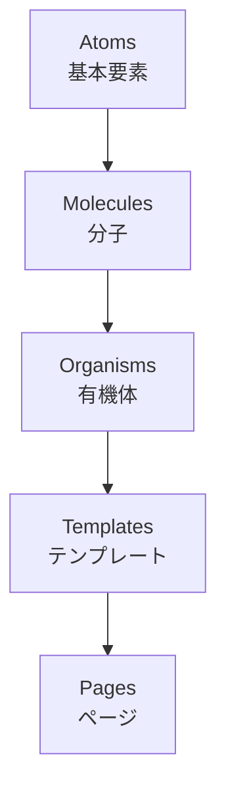
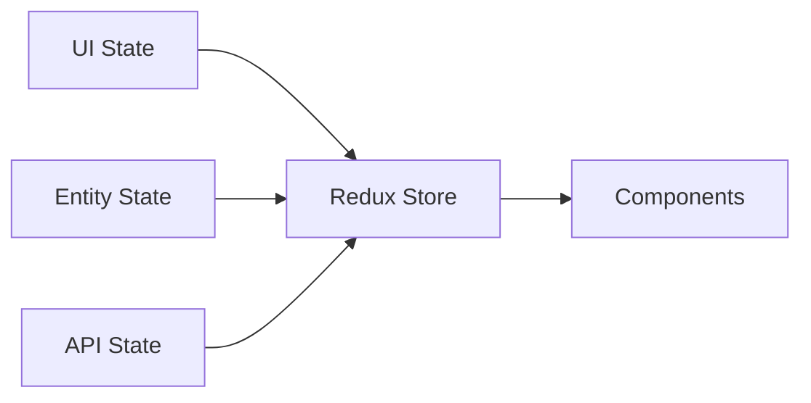
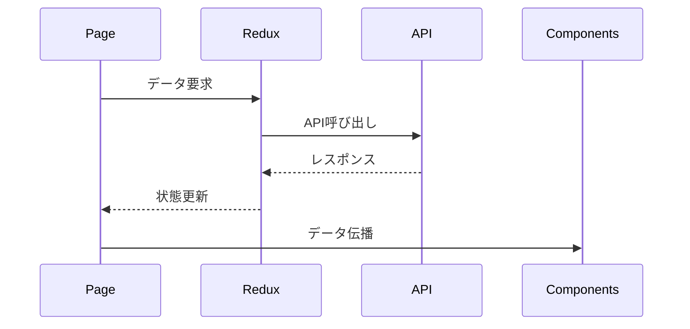

# コンポーネント設計ドキュメント

## 1. 🎯 設計原則

### Atomic Design
本プロジェクトでは、コンポーネントの再利用性と保守性を高めるため、Atomic Designパターンを採用します。

## 2. 🧱 コンポーネント階層

### Atoms（原子）
最小単位のUIコンポーネント
- Button
  - PrimaryButton
  - SecondaryButton
  - IconButton
- Input
  - TextInput
  - SearchInput
  - TextArea
- Text
  - Heading
  - Paragraph
  - Caption
- Icon
  - SystemIcon
  - StatusIcon
- Label
  - FormLabel
  - Tag
  - Badge

### Molecules（分子）
Atomsを組み合わせた機能単位
- SearchBar
  - SearchInput
  - SearchButton
- FormField
  - Label
  - Input
  - ValidationMessage
- Card
  - CardTitle
  - CardContent
  - CardActions
- ListItem
  - Icon
  - Text
  - ActionButton

### Organisms（有機体）
特定のインターフェース領域を形成する単位
- Header
  - Logo
  - Navigation
  - SearchBar
  - UserMenu
- FAQList
  - SearchBar
  - CategoryFilter
  - QuestionList
- ChatWindow
  - MessageList
  - InputArea
  - ToolBar
- Sidebar
  - Navigation
  - FilterPanel
  - CategoryTree

### Templates（テンプレート）
ページのレイアウト構造
- MainLayout
  - Header
  - Sidebar
  - MainContent
  - Footer
- FAQLayout
  - Header
  - CategoryNav
  - ContentArea
  - RelatedFAQs
- ChatLayout
  - Header
  - ChatWindow
  - FAQPanel
  - UserInfo

### Pages（ページ）
実際のコンテンツを配置したページ
- FAQListPage
  - FAQLayout
  - FAQList
  - CategoryFilter
  - Pagination
- FAQDetailPage
  - FAQLayout
  - ArticleContent
  - RelatedQuestions
  - Feedback
- ChatPage
  - ChatLayout
  - ChatWindow
  - FAQSuggestions
  - UserProfile

## 3. 🎨 スタイリング戦略

### デザインシステム
- Material-UI（MUI）をベースとしたカスタムテーマ
- ダークモード対応
- レスポンシブデザイン

### CSS設計
- CSS-in-JS（MUIのstyled API）
- Theme Provider による一貫したデザイン
- Responsive breakpoints の統一管理

## 4. 💾 状態管理

### Reduxスライス構造

### 状態の種類
- **UIState**
  - モーダルの表示状態
  - サイドバーの開閉状態
  - 選択中のタブ
- **EntityState**
  - FAQデータ
  - ユーザー情報
  - カテゴリ情報
- **APIState**
  - ローディング状態
  - エラー状態
  - キャッシュ状態

## 5. 🔄 コンポーネントライフサイクル

### データフェッチング

### エラーハンドリング
- ErrorBoundary による例外捕捉
- フォールバックUI の表示
- エラーログの収集

## 6. 📱 レスポンシブ対応

### ブレークポイント
- xs: 0px
- sm: 600px
- md: 960px
- lg: 1280px
- xl: 1920px

### レイアウト戦略
- モバイルファースト設計
- Grid システムの活用
- コンポーネントの条件付きレンダリング

## 7. ♿ アクセシビリティ

### 対応方針
- WAI-ARIA 準拠
- キーボード操作対応
- スクリーンリーダー対応
- カラーコントラスト基準の遵守

## 8. 🧪 テスト戦略

### テストレベル
- **Unit Tests**
  - 個別コンポーネントのテスト
  - カスタムフックのテスト
- **Integration Tests**
  - コンポーネント間の連携テスト
  - Reduxとの結合テスト
- **E2E Tests**
  - ユーザーシナリオテスト
  - クリティカルパスの検証

## 9. 📚 ドキュメント化

### Storybook
- コンポーネントカタログ
- インタラクティブなドキュメント
- ビジュアルリグレッションテスト

### API Documentation
- TypeDoc による型定義ドキュメント
- Props のインターフェース定義
- ユースケース例の提供