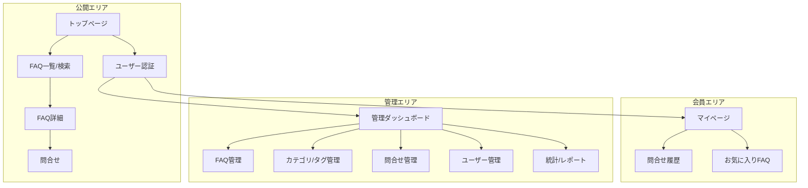
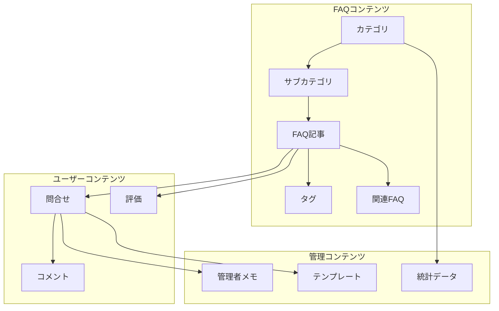
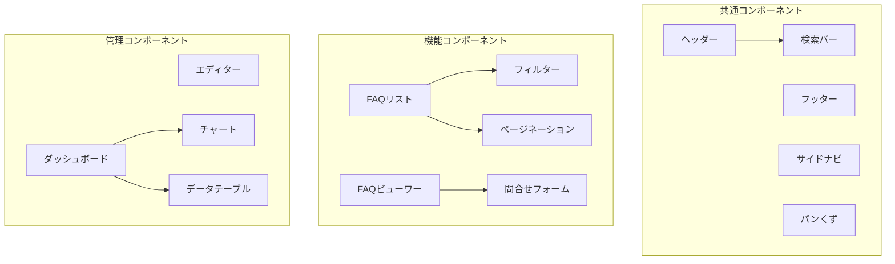
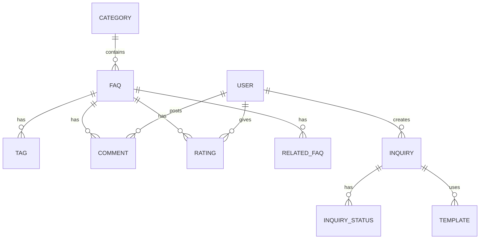
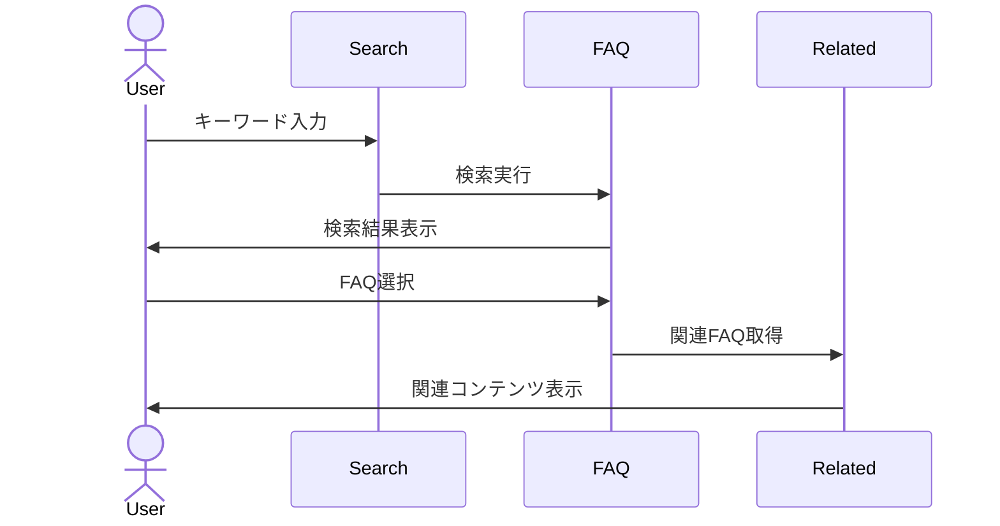
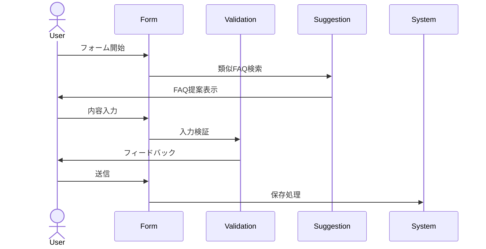

# FAQシステム 情報アーキテクチャ設計書

## 1. 📍 サイトマップ構造



## 2. 🔄 コンテンツ階層構造



## 3. 🧩 コンポーネント階層設計



## 4. 🔍 データ関係モデル



## 5. 🚶 主要ユーザーフロー

### 5.1 FAQ検索・閲覧フロー


### 5.2 問合せ作成フロー


## 6. 🎯 SEO最適化設計

### メタデータ構造
```yaml
# ページ共通メタデータ
base_meta:
  charset: UTF-8
  viewport: width=device-width, initial-scale=1
  robots: index, follow

# FAQ記事メタデータ
faq_meta:
  title: {カテゴリ} - {FAQ表題} | {サイト名}
  description: {FAQ要約, 最大160文字}
  keywords: {関連キーワード, カンマ区切り}
  og:type: article
  article:published_time: {公開日時}
  article:modified_time: {更新日時}
```

### 構造化データ
```json
{
  "@context": "https://schema.org",
  "@type": "FAQPage",
  "mainEntity": [{
    "@type": "Question",
    "name": "FAQ質問",
    "acceptedAnswer": {
      "@type": "Answer",
      "text": "FAQ回答"
    }
  }]
}
```

## 7. ♿ アクセシビリティ設計

### WAI-ARIA実装方針
```yaml
# ランドマーク
landmarks:
  header: role="banner"
  nav: role="navigation"
  main: role="main"
  search: role="search"
  footer: role="contentinfo"

# コンポーネント
components:
  search:
    input: aria-label="検索"
    button: aria-label="検索実行"
  
  faq_list:
    region: role="region" aria-label="FAQ一覧"
    item: role="article"
  
  pagination:
    nav: role="navigation" aria-label="ページネーション"
    button: aria-label="ページ{n}へ移動"
```

## 8. 📱 レスポンシブ対応方針

### ブレークポイント定義
```css
// デバイス別ブレークポイント
@mixin mobile {
  @media (max-width: 767px) { @content; }
}

@mixin tablet {
  @media (min-width: 768px) and (max-width: 1023px) { @content; }
}

@mixin desktop {
  @media (min-width: 1024px) { @content; }
}

// レイアウトパターン
.layout {
  // モバイル: 縦積みレイアウト
  @include mobile {
    flex-direction: column;
  }
  
  // タブレット: 2カラムグリッド
  @include tablet {
    grid-template-columns: repeat(2, 1fr);
  }
  
  // デスクトップ: 3カラムグリッド
  @include desktop {
    grid-template-columns: repeat(3, 1fr);
  }
}
```

## 9. 🔒 状態管理パターン

```mermaid
graph TD
    subgraph "グローバル状態"
        A[認証状態]
        B[ユーザー設定]
        C[システム通知]
    end

    subgraph "ページ状態"
        D[検索条件]
        E[フィルター設定]
        F[ソート設定]
    end

    subgraph "コンポーネント状態"
        G[フォーム入力]
        H[UI状態]
        I[アニメーション]
    end

    A --> D
    B --> E
    D --> G
    E --> H