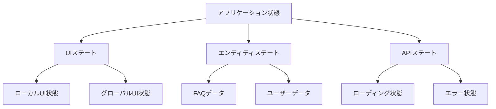
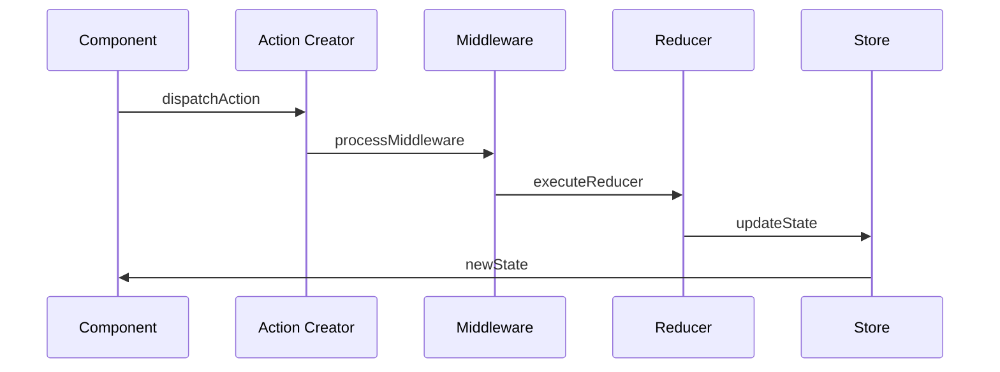

# 状態管理設計書

## 1. 🎯 状態管理の基本方針

### 採用技術
- **Redux Toolkit**
  - 型安全性の確保
  - ボイラープレートの削減
  - 不変性の自動管理

### 状態の分類


## 2. 🏗️ Reduxストア設計

### ストア構成
```typescript
// ルートステートの型定義
interface RootState {
  ui: UIState;
  entities: EntityState;
  api: ApiState;
}

// UIステート
interface UIState {
  theme: 'light' | 'dark';
  sidebar: {
    isOpen: boolean;
    activeMenu: string;
  };
  modal: {
    isOpen: boolean;
    type: ModalType;
    data?: any;
  };
}

// エンティティステート
interface EntityState {
  faqs: {
    byId: Record<string, FAQ>;
    allIds: string[];
  };
  categories: {
    byId: Record<string, Category>;
    allIds: string[];
  };
  users: {
    currentUser: User | null;
    profiles: Record<string, UserProfile>;
  };
}

// APIステート
interface ApiState {
  loading: Record<string, boolean>;
  errors: Record<string, Error | null>;
  cache: Record<string, {
    data: any;
    timestamp: number;
  }>;
}
```

## 3. 🔄 状態更新フロー

### Reduxアクション設計


### スライス設計例
```typescript
// FAQスライスの例
const faqSlice = createSlice({
  name: 'faqs',
  initialState: {
    byId: {},
    allIds: [],
    loading: false,
    error: null
  },
  reducers: {
    addFaq: (state, action: PayloadAction<FAQ>) => {
      state.byId[action.payload.id] = action.payload;
      state.allIds.push(action.payload.id);
    },
    updateFaq: (state, action: PayloadAction<FAQ>) => {
      state.byId[action.payload.id] = action.payload;
    },
    removeFaq: (state, action: PayloadAction<string>) => {
      delete state.byId[action.payload];
      state.allIds = state.allIds.filter(id => id !== action.payload);
    }
  },
  extraReducers: (builder) => {
    builder
      .addCase(fetchFaqs.pending, (state) => {
        state.loading = true;
      })
      .addCase(fetchFaqs.fulfilled, (state, action) => {
        state.loading = false;
        // データの正規化と保存
      })
      .addCase(fetchFaqs.rejected, (state, action) => {
        state.loading = false;
        state.error = action.error;
      });
  }
});
```

## 4. 🎣 カスタムフック設計

### データアクセスフック
```typescript
// FAQ用カスタムフック
export const useFAQ = (id: string) => {
  const faq = useSelector((state: RootState) => state.entities.faqs.byId[id]);
  const loading = useSelector((state: RootState) => state.api.loading[`faq/${id}`]);
  const error = useSelector((state: RootState) => state.api.errors[`faq/${id}`]);
  
  const dispatch = useDispatch();
  
  const updateFaq = useCallback((data: Partial<FAQ>) => {
    dispatch(faqActions.updateFaq({ id, ...data }));
  }, [dispatch, id]);
  
  return { faq, loading, error, updateFaq };
};
```

## 5. 📡 非同期処理設計

### RTK Query の活用
```typescript
// FAQ API定義
export const faqApi = createApi({
  reducerPath: 'faqApi',
  baseQuery: fetchBaseQuery({ baseUrl: '/api' }),
  endpoints: (builder) => ({
    getFaqs: builder.query<FAQ[], void>({
      query: () => 'faqs',
    }),
    getFaqById: builder.query<FAQ, string>({
      query: (id) => `faqs/${id}`,
    }),
    createFaq: builder.mutation<FAQ, Partial<FAQ>>({
      query: (body) => ({
        url: 'faqs',
        method: 'POST',
        body,
      }),
    }),
    updateFaq: builder.mutation<FAQ, { id: string; body: Partial<FAQ> }>({
      query: ({ id, body }) => ({
        url: `faqs/${id}`,
        method: 'PATCH',
        body,
      }),
    }),
  }),
});
```

## 6. 🔒 状態永続化

### 永続化設計
```typescript
// 永続化設定
const persistConfig = {
  key: 'root',
  storage,
  whitelist: ['entities', 'ui'],
  blacklist: ['api'],
  transforms: [
    encryptTransform({
      secretKey: process.env.ENCRYPTION_KEY
    })
  ]
};

// 永続化reducer
const persistedReducer = persistReducer(persistConfig, rootReducer);
```

## 7. 🎭 状態正規化

### データ正規化戦略
```typescript
// 正規化されたステート構造
interface NormalizedState {
  entities: {
    faqs: {
      byId: Record<string, FAQ>;
      allIds: string[];
    };
    categories: {
      byId: Record<string, Category>;
      allIds: string[];
    };
    tags: {
      byId: Record<string, Tag>;
      allIds: string[];
    };
  };
  relations: {
    faqCategories: Record<string, string[]>;
    faqTags: Record<string, string[]>;
  };
}
```

## 8. 📊 パフォーマンス最適化

### メモ化戦略
```typescript
// セレクターの最適化
export const selectFilteredFaqs = createSelector(
  [
    (state: RootState) => state.entities.faqs.byId,
    (state: RootState) => state.entities.faqs.allIds,
    (_, category: string) => category
  ],
  (faqs, ids, category) => {
    return ids
      .map(id => faqs[id])
      .filter(faq => faq.category === category);
  }
);
```

## 9. 🧪 テスト戦略

### Reduxテスト
```typescript
// リデューサーテスト
describe('faqSlice', () => {
  it('should handle initial state', () => {
    expect(faqReducer(undefined, { type: 'unknown' })).toEqual({
      byId: {},
      allIds: [],
      loading: false,
      error: null
    });
  });

  it('should handle addFaq', () => {
    const actual = faqReducer(initialState, addFaq(mockFaq));
    expect(actual.byId[mockFaq.id]).toEqual(mockFaq);
    expect(actual.allIds).toContain(mockFaq.id);
  });
});
```

## 10. 📈 スケーラビリティ対策

### 大規模アプリケーション対応
- 動的モジュールローディング
- 状態の分割管理
- キャッシュ戦略の最適化
- パフォーマンスモニタリング

```typescript
// 動的スライスローディング
const dynamicSlice = createDynamicSlice({
  name: 'dynamic',
  reducers: {
    // reducers
  },
  onLoad: () => {
    // 初期化ロジック
  },
  onUnload: () => {
    // クリーンアップロジック
  }
});