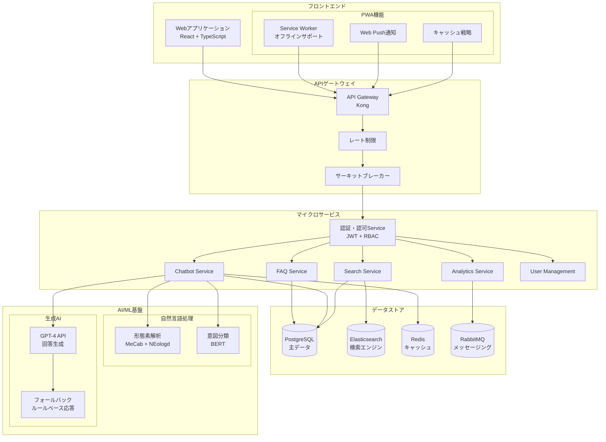
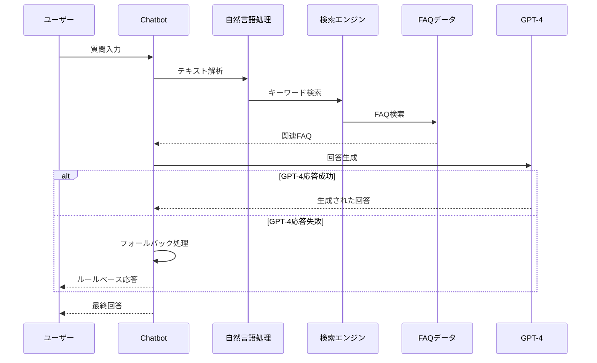
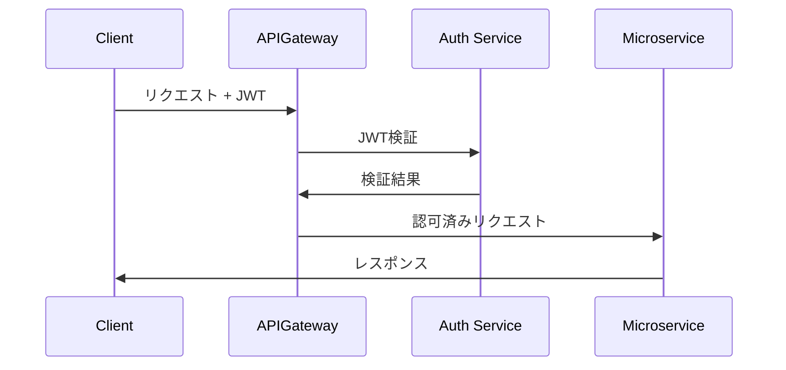
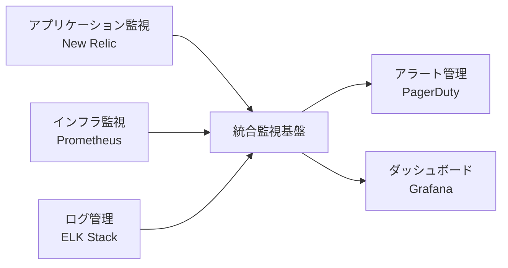
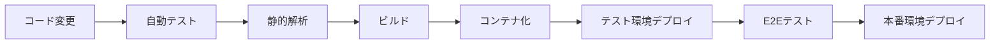

# システムアーキテクチャ設計書

## 1. 📋 概要

### 目的
本文書は、FAQシステムのアーキテクチャ設計の詳細を定義し、システムの構築指針を示すものです。

### スコープ
- FAQ管理システム
- AIチャットボット
- 分析・レポーティング機能
- 運用管理機能

## 2. 🏗️ システムアーキテクチャ概要

### 全体アーキテクチャ図

### データフロー図

## 3. 🛠️ 技術スタックの選定

### フロントエンド
- **フレームワーク**: React + TypeScript
  - 採用理由：
    - 豊富なエコシステムと実績
    - 型安全性による開発効率向上
    - コンポーネントベースの開発容易性
  - 主要ライブラリ：
    - Redux Toolkit（状態管理）
    - React Query（データフェッチング）
    - Material-UI（UIコンポーネント）
    - Jest + React Testing Library（テスト）

### バックエンド
- **APIゲートウェイ**: Kong
  - 採用理由：
    - 高性能なルーティング
    - 豊富な認証・認可機能
    - プラグインによる拡張性
    
- **マイクロサービス**: Node.js + Express + TypeScript
  - 採用理由：
    - 非同期処理の高い性能
    - TypeScriptによる型安全性
    - フロントエンドとの技術スタック統一
  
- **AI/ML基盤**: Python + FastAPI
  - 採用理由：
    - 豊富なML/NLPライブラリ
    - 高性能な非同期処理
    - OpenAPI対応の容易さ

### データストア
- **主データベース**: PostgreSQL
  - 採用理由：
    - 高い信頼性と実績
    - JSONBによる柔軟なデータ構造
    - 強力なクエリ機能
    
- **検索エンジン**: Elasticsearch
  - 採用理由：
    - 高速な全文検索
    - スケーラビリティ
    - 日本語検索の優れたサポート
    
- **キャッシュ**: Redis
  - 採用理由：
    - 高速なパフォーマンス
    - セッション管理の容易さ
    - Pub/Sub機能
    
- **メッセージキュー**: RabbitMQ
  - 採用理由：
    - 信頼性の高いメッセージング
    - 柔軟なルーティング
    - 豊富な運用実績

## 4. 🔀 マイクロサービスアーキテクチャ

### 採用理由
1. **スケーラビリティ**
   - サービスごとの独立したスケーリング
   - 負荷に応じた柔軟なリソース配分

2. **開発効率**
   - チーム単位での並行開発
   - サービスごとの独立したデプロイ

3. **技術の柔軟性**
   - サービスごとの最適な技術選択
   - 段階的な技術更新の容易さ

### サービス構成
1. **FAQ Service**
   - FAQ記事の管理
   - カテゴリ/タグ管理
   - バージョン管理

2. **Chatbot Service**
   - 対話管理
   - NLP処理
   - 回答生成

3. **Search Service**
   - 全文検索
   - インデックス管理
   - 検索最適化

4. **Analytics Service**
   - ログ収集
   - データ分析
   - レポート生成

5. **User Management Service**
   - ユーザー認証/認可
   - プロファイル管理
   - アクセス制御

## 5. 🔒 セキュリティ設計

### 認証・認可

### セキュリティ対策
1. **通信セキュリティ**
   - TLS 1.3の強制
   - 証明書の自動更新
   - HTTP Securityヘッダーの適用

2. **データ保護**
   - 保存データの暗号化
   - 個人情報の匿名化
   - アクセスログの暗号化

3. **脆弱性対策**
   - 依存パッケージの定期スキャン
   - WAFの導入
   - ペネトレーションテストの定期実施

## 6. 📈 性能要件と監視戦略

### 性能要件
1. **レスポンス時間**
   - API応答: 200ms以内
   - 検索結果: 1秒以内
   - チャットボット応答: 2秒以内

2. **スループット**
   - 同時接続数: 1000以上
   - 1日あたりの処理件数: 10万件以上

3. **可用性**
   - サービス稼働率: 99.9%以上
   - 計画メンテナンス時間を除く

### 監視戦略

## 7. 🚀 CI/CD パイプライン

### パイプライン構成

### 品質管理
1. **自動テスト**
   - ユニットテスト
   - 統合テスト
   - E2Eテスト

2. **コード品質**
   - ESLint/Prettier
   - SonarQube
   - TypeScript厳格モード

3. **デプロイメント**
   - Blue/Greenデプロイ
   - カナリアリリース
   - ロールバック機能

## 8. 📱 PWAサポート詳細

### フロントエンド機能
1. **Service Worker**
   - オフラインコンテンツのキャッシュ
   - バックグラウンド同期
   - プッシュ通知の受信

2. **キャッシュ戦略**
   - Network First（オンライン優先）
   - Cache First（オフライン対応FAQ）
   - Stale While Revalidate（更新確認）

3. **Web Push通知**
   - 新規FAQ追加通知
   - チャット応答通知
   - システムアップデート通知

4. **オフライン機能**
   - FAQ閲覧
   - 検索履歴
   - 下書き保存

## 9. 🛠️ エラーハンドリング戦略

### システム全体
1. **API障害対策**
   - リトライ戦略
     - 指数バックオフ
     - 最大リトライ回数: 3回
     - タイムアウト: 5秒
   - サーキットブレーカー
     - 失敗率50%でOpen
     - Half-Open期間: 30秒
   - フォールバック
     - キャッシュデータの利用
     - 代替エンドポイントへの切り替え

2. **メッセージング障害対策**
   - RabbitMQ
     - Dead Letter Exchange
     - メッセージ永続化
     - クラスタリング構成
   - リトライキュー
     - 段階的な遅延
     - エラーログ記録
     - 手動リカバリー

3. **AI/ML障害対策**
   - GPT-4 API
     - レート制限対応
     - タイムアウト設定
     - フォールバック応答
   - NLP処理
     - ローカルモデルへの切り替え
     - ルールベース処理への縮退

4. **データストア障害対策**
   - PostgreSQL
     - レプリケーション
     - フェイルオーバー
     - 自動バックアップ
   - Redis
     - センチネル構成
     - 永続化設定
     - クラスタリング

## 10. 🔄 拡張性と進化戦略

### スケーリング戦略
1. **垂直スケーリング**
   - インスタンスのリソース増強
   - データベースのスペック向上

2. **水平スケーリング**
   - サービスの複製
   - データベースのレプリケーション
   - キャッシュの分散化

### 将来の拡張性
1. **新機能追加**
   - マイクロサービスの追加
   - 新しいAPIエンドポイント
   - UIコンポーネントの拡張

2. **パフォーマンス向上**
   - キャッシュ戦略の最適化
   - クエリのチューニング
   - CDNの活用

3. **インテグレーション**
   - 外部サービスとの連携
   - APIの拡張
   - データ連携の強化