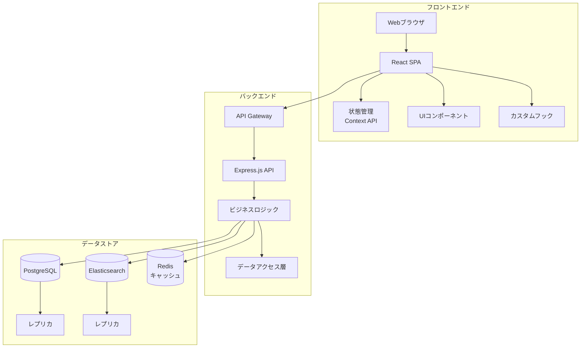
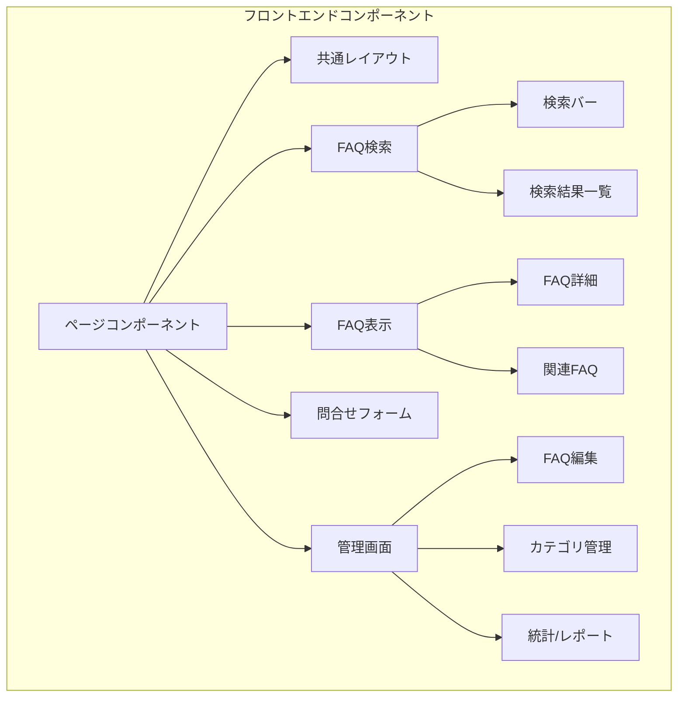
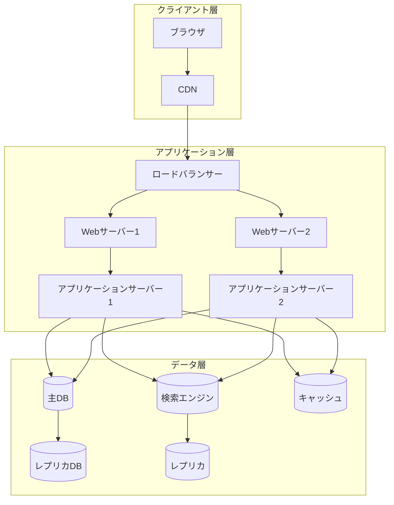
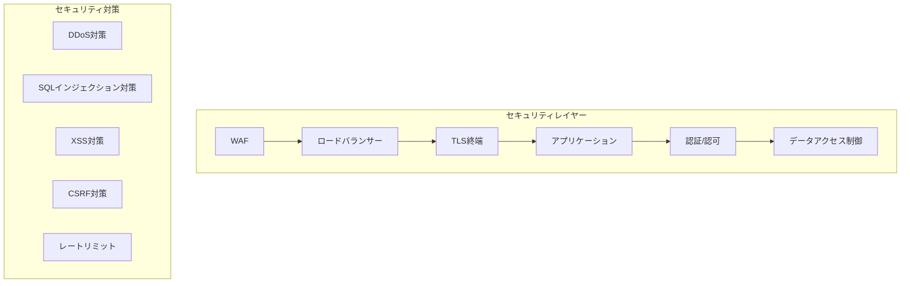

# FAQシステム アーキテクチャ設計書

## 1. システム全体構成 🏗️



## 2. コンポーネント構成 🧩



## 3. インフラストラクチャ構成 🌐



## 4. 技術スタック 🛠️

### フロントエンド
- **フレームワーク**: React + TypeScript
- **状態管理**: Context API
- **UIライブラリ**: Material-UI
- **ビルドツール**: Vite
- **テスト**: Jest + React Testing Library

### バックエンド
- **フレームワーク**: Express.js + TypeScript
- **認証**: JWT + RBAC
- **APIドキュメント**: OpenAPI (Swagger)
- **テスト**: Jest

### データストア
- **メインDB**: PostgreSQL
- **検索エンジン**: Elasticsearch
- **キャッシュ**: Redis

### インフラ
- **Webサーバー**: Nginx
- **コンテナ化**: Docker
- **CI/CD**: GitHub Actions
- **監視**: Prometheus + Grafana

## 5. セキュリティアーキテクチャ 🔒



## 6. 可用性設計 ⚡

### 冗長化構成
- Webサーバー/APサーバーの冗長化
- データベースのレプリケーション
- 検索エンジンのクラスタリング

### バックアップ戦略
- データベースの定期バックアップ（日次）
- 差分バックアップ（1時間毎）
- バックアップデータの暗号化

### 監視体制
- サーバーリソース監視
- アプリケーションログ監視
- セキュリティ監視
- パフォーマンス監視

## 7. パフォーマンス設計 🚀

### キャッシュ戦略
- ブラウザキャッシュ
- CDNキャッシュ
- アプリケーションキャッシュ
- データベースクエリキャッシュ

### スケーリング戦略
- 水平スケーリング（サーバー台数の増加）
- 垂直スケーリング（サーバースペックの増強）
- データベースシャーディング

## 8. 運用監視設計 📊

```mermaid
graph LR
    A[メトリクス収集] --> B[Prometheus]
    B --> C[Grafana]
    D[ログ収集] --> E[Elasticsearch]
    E --> F[Kibana]
    G[アラート] --> H[通知システム]