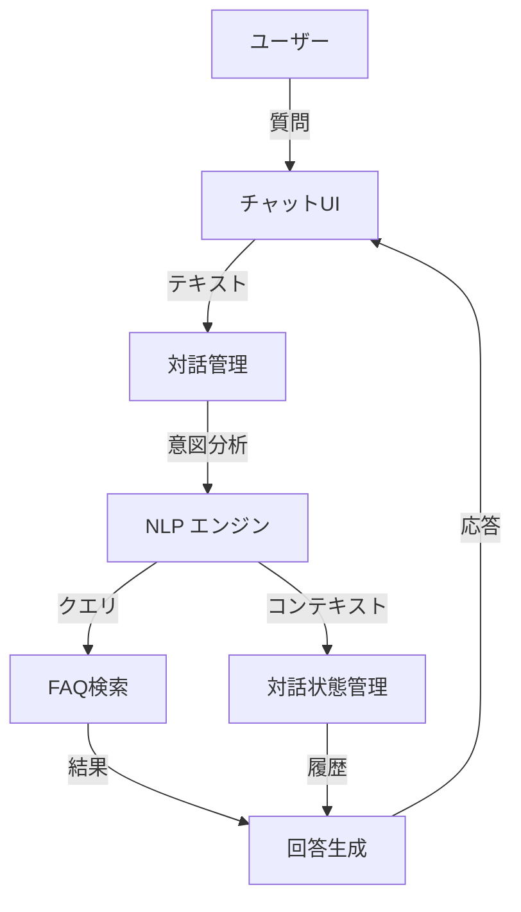

# AIチャットボット機能仕様書

## 1. 🤖 システム概要

### 目的
- FAQ検索の効率化
- 24時間365日の自動応答対応
- ユーザー体験の向上
- サポートコストの削減

### アーキテクチャ


## 2. 💬 対話システム設計

### 対話フロー
1. **初期応答**
   - 挨拶と利用案内
   - よくある質問の提示
   - ヘルプコマンドの説明

2. **質問理解**
   - 自然言語処理による意図分析
   - キーワード抽出
   - 文脈の維持と更新

3. **回答生成**
   - FAQ検索結果の要約
   - 関連情報の提示
   - フォローアップ質問の生成

4. **エスカレーション**
   - 解決できない場合の人的対応への引継ぎ
   - オペレーター呼び出し条件の設定
   - チャット履歴の転送

### 対話モード
1. **FAQ検索モード**
   ```mermaid
   sequenceDiagram
       User->>Bot: 質問入力
       Bot->>NLP: 意図分析
       NLP->>Search: キーワード検索
       Search->>Bot: FAQ検索結果
       Bot->>User: 回答と関連FAQ
   ```

2. **ガイド対話モード**
   ```mermaid
   sequenceDiagram
       User->>Bot: 曖昧な質問
       Bot->>User: 詳細確認
       User->>Bot: 追加情報
       Bot->>Search: 絞り込み検索
       Bot->>User: 具体的な回答
   ```

## 3. 🧠 AI機能詳細

### 自然言語処理（NLP）
- **形態素解析**
  - MeCab + NEologd辞書
  - カスタム辞書登録機能
  - 新語・固有名詞の自動学習

- **意図分類**
  - BERT日本語モデル使用
  - マルチラベル分類
  - 信頼度スコアリング

- **文脈理解**
  - Transformerベースの文脈モデル
  - 最大5ターンの会話履歴保持
  - 文脈に応じた応答生成

### 回答生成エンジン
- **ベースモデル**
  - GPT-4 API使用
  - プロンプトエンジニアリング
  - コンテキスト制御

- **FAQ検索連携**
  - Elasticsearchとの統合
  - セマンティック検索
  - ハイブリッド検索（キーワード + 意味的類似性）

- **応答カスタマイズ**
  - トーン・話調の一貫性維持
  - 企業固有の表現規則適用
  - 禁止語・注意語のフィルタリング

## 4. 📈 学習・改善システム

### データ収集
- **対話ログ**
  - 質問・回答ペア
  - ユーザーフィードバック
  - エラー・未解決ケース

- **FAQ更新連携**
  - 新規FAQ自動提案
  - 既存FAQ改善提案
  - トレンド分析レポート

### モデル更新
- **定期更新**
  - 週次バッチ学習
  - モデル評価・検証
  - A/Bテスト実施

- **緊急更新**
  - 重大な誤回答の即時修正
  - ブラックリスト更新
  - ルール追加

## 5. 🎯 性能要件

### レスポンス時間
- 初期応答: 1秒以内
- 通常応答: 2秒以内
- タイムアウト: 10秒

### 精度目標
- 意図理解精度: 90%以上
- 回答適合率: 85%以上
- エスカレーション率: 15%以下

### スケーラビリティ
- 同時対話数: 1000セッション
- 1日あたりの対話数: 10万件
- ピーク時の応答性能維持

## 6. 🔒 セキュリティ対策

### 入力検証
- **サニタイズ処理**
  - XSS対策
  - SQLインジェクション対策
  - コマンドインジェクション対策

- **禁止語フィルター**
  - 不適切な表現
  - 機密情報パターン
  - 個人情報パターン

### データ保護
- **会話ログ**
  - 個人情報の自動マスキング
  - 保存期間の設定（3ヶ月）
  - アクセス権限の制御

- **認証・認可**
  - ユーザー認証連携
  - IPアドレス制限
  - アクセストークン管理

## 7. 📊 モニタリング

### リアルタイムモニタリング
- **パフォーマンス**
  - 応答時間
  - エラー率
  - 同時接続数

- **品質**
  - 意図理解精度
  - 回答適合率
  - ユーザー満足度

### アラート設定
- **即時通知**
  - エラー率閾値超過
  - 応答時間遅延
  - 不適切回答検出

- **定期レポート**
  - 日次サマリー
  - 週次品質レポート
  - 月次トレンド分析

## 8. 🔄 フェーズ別実装計画

### フェーズ1（基本機能）
- 基本的な質問応答
- FAQ検索連携
- シンプルな対話管理

### フェーズ2（高度化）
- 文脈理解の改善
- 回答生成の精緻化
- 学習システムの導入

### フェーズ3（最適化）
- マルチモーダル対応
- 多言語対応
- 高度な分析機能