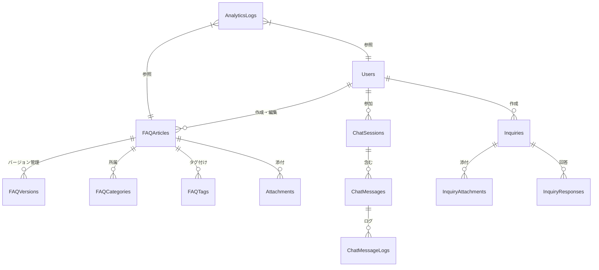

# データベース設計書

## 1. 📊 ER図

### 全体ER図


## 2. 📝 テーブル定義

### Users（ユーザー）
```sql
CREATE TABLE users (
    id BIGSERIAL PRIMARY KEY,
    email VARCHAR(255) NOT NULL UNIQUE,
    encrypted_password VARCHAR(255) NOT NULL,
    full_name VARCHAR(100) NOT NULL,
    role VARCHAR(20) NOT NULL,
    organization VARCHAR(100),
    last_login_at TIMESTAMP WITH TIME ZONE,
    created_at TIMESTAMP WITH TIME ZONE NOT NULL DEFAULT CURRENT_TIMESTAMP,
    updated_at TIMESTAMP WITH TIME ZONE NOT NULL DEFAULT CURRENT_TIMESTAMP,
    deleted_at TIMESTAMP WITH TIME ZONE
);

CREATE INDEX idx_users_email ON users(email);
CREATE INDEX idx_users_role ON users(role);
```

### FAQArticles（FAQ記事）
```sql
CREATE TABLE faq_articles (
    id BIGSERIAL PRIMARY KEY,
    title VARCHAR(200) NOT NULL,
    content TEXT NOT NULL,
    status VARCHAR(20) NOT NULL,
    view_count INTEGER NOT NULL DEFAULT 0,
    author_id BIGINT NOT NULL REFERENCES users(id),
    published_at TIMESTAMP WITH TIME ZONE,
    created_at TIMESTAMP WITH TIME ZONE NOT NULL DEFAULT CURRENT_TIMESTAMP,
    updated_at TIMESTAMP WITH TIME ZONE NOT NULL DEFAULT CURRENT_TIMESTAMP,
    deleted_at TIMESTAMP WITH TIME ZONE,
    search_vector TSVECTOR,
    CONSTRAINT faq_articles_status_check 
        CHECK (status IN ('draft', 'published', 'archived'))
);

CREATE INDEX idx_faq_articles_status ON faq_articles(status);
CREATE INDEX idx_faq_articles_search ON faq_articles USING gin(search_vector);
```

### FAQVersions（FAQバージョン）
```sql
CREATE TABLE faq_versions (
    id BIGSERIAL PRIMARY KEY,
    faq_article_id BIGINT NOT NULL REFERENCES faq_articles(id),
    content TEXT NOT NULL,
    version_number INTEGER NOT NULL,
    created_by BIGINT NOT NULL REFERENCES users(id),
    created_at TIMESTAMP WITH TIME ZONE NOT NULL DEFAULT CURRENT_TIMESTAMP,
    UNIQUE (faq_article_id, version_number)
);

CREATE INDEX idx_faq_versions_article ON faq_versions(faq_article_id);
```

### FAQCategories（FAQカテゴリ）
```sql
CREATE TABLE faq_categories (
    id BIGSERIAL PRIMARY KEY,
    name VARCHAR(100) NOT NULL,
    parent_id BIGINT REFERENCES faq_categories(id),
    level INTEGER NOT NULL,
    created_at TIMESTAMP WITH TIME ZONE NOT NULL DEFAULT CURRENT_TIMESTAMP,
    updated_at TIMESTAMP WITH TIME ZONE NOT NULL DEFAULT CURRENT_TIMESTAMP,
    CONSTRAINT faq_categories_level_check 
        CHECK (level BETWEEN 1 AND 3)
);

CREATE TABLE faq_article_categories (
    faq_article_id BIGINT NOT NULL REFERENCES faq_articles(id),
    category_id BIGINT NOT NULL REFERENCES faq_categories(id),
    created_at TIMESTAMP WITH TIME ZONE NOT NULL DEFAULT CURRENT_TIMESTAMP,
    PRIMARY KEY (faq_article_id, category_id)
);
```

### FAQTags（FAQタグ）
```sql
CREATE TABLE faq_tags (
    id BIGSERIAL PRIMARY KEY,
    name VARCHAR(50) NOT NULL UNIQUE,
    created_at TIMESTAMP WITH TIME ZONE NOT NULL DEFAULT CURRENT_TIMESTAMP
);

CREATE TABLE faq_article_tags (
    faq_article_id BIGINT NOT NULL REFERENCES faq_articles(id),
    tag_id BIGINT NOT NULL REFERENCES faq_tags(id),
    created_at TIMESTAMP WITH TIME ZONE NOT NULL DEFAULT CURRENT_TIMESTAMP,
    PRIMARY KEY (faq_article_id, tag_id)
);

CREATE INDEX idx_faq_tags_name ON faq_tags(name);
```

### ChatSessions（チャットセッション）
```sql
CREATE TABLE chat_sessions (
    id BIGSERIAL PRIMARY KEY,
    user_id BIGINT REFERENCES users(id),
    session_token VARCHAR(255) NOT NULL UNIQUE,
    status VARCHAR(20) NOT NULL,
    started_at TIMESTAMP WITH TIME ZONE NOT NULL DEFAULT CURRENT_TIMESTAMP,
    ended_at TIMESTAMP WITH TIME ZONE,
    CONSTRAINT chat_sessions_status_check 
        CHECK (status IN ('active', 'inactive', 'closed'))
);

CREATE INDEX idx_chat_sessions_token ON chat_sessions(session_token);
CREATE INDEX idx_chat_sessions_user ON chat_sessions(user_id);
```

### ChatMessages（チャットメッセージ）
```sql
CREATE TABLE chat_messages (
    id BIGSERIAL PRIMARY KEY,
    session_id BIGINT NOT NULL REFERENCES chat_sessions(id),
    message_type VARCHAR(20) NOT NULL,
    content TEXT NOT NULL,
    role VARCHAR(20) NOT NULL,
    created_at TIMESTAMP WITH TIME ZONE NOT NULL DEFAULT CURRENT_TIMESTAMP,
    CONSTRAINT chat_messages_type_check 
        CHECK (message_type IN ('text', 'system', 'error')),
    CONSTRAINT chat_messages_role_check 
        CHECK (role IN ('user', 'assistant', 'system'))
);

CREATE INDEX idx_chat_messages_session ON chat_messages(session_id);
```

### ChatMessageLogs（チャットメッセージログ）
```sql
CREATE TABLE chat_message_logs (
    id BIGSERIAL PRIMARY KEY,
    message_id BIGINT NOT NULL REFERENCES chat_messages(id),
    intent_type VARCHAR(50),
    confidence_score DECIMAL(5,4),
    processing_time INTEGER,
    created_at TIMESTAMP WITH TIME ZONE NOT NULL DEFAULT CURRENT_TIMESTAMP
);

CREATE INDEX idx_chat_message_logs_message ON chat_message_logs(message_id);
```

### Inquiries（問い合わせ）
```sql
CREATE TABLE inquiries (
    id BIGSERIAL PRIMARY KEY,
    user_id BIGINT REFERENCES users(id),
    subject VARCHAR(200) NOT NULL,
    content TEXT NOT NULL,
    status VARCHAR(20) NOT NULL,
    priority VARCHAR(20) NOT NULL,
    assigned_to BIGINT REFERENCES users(id),
    created_at TIMESTAMP WITH TIME ZONE NOT NULL DEFAULT CURRENT_TIMESTAMP,
    updated_at TIMESTAMP WITH TIME ZONE NOT NULL DEFAULT CURRENT_TIMESTAMP,
    CONSTRAINT inquiries_status_check 
        CHECK (status IN ('new', 'in_progress', 'pending', 'resolved', 'closed')),
    CONSTRAINT inquiries_priority_check 
        CHECK (priority IN ('low', 'medium', 'high', 'urgent'))
);

CREATE INDEX idx_inquiries_status ON inquiries(status);
CREATE INDEX idx_inquiries_priority ON inquiries(priority);
CREATE INDEX idx_inquiries_assigned_to ON inquiries(assigned_to);
```

### InquiryResponses（問い合わせ回答）
```sql
CREATE TABLE inquiry_responses (
    id BIGSERIAL PRIMARY KEY,
    inquiry_id BIGINT NOT NULL REFERENCES inquiries(id),
    responder_id BIGINT NOT NULL REFERENCES users(id),
    content TEXT NOT NULL,
    is_internal BOOLEAN NOT NULL DEFAULT false,
    created_at TIMESTAMP WITH TIME ZONE NOT NULL DEFAULT CURRENT_TIMESTAMP
);

CREATE INDEX idx_inquiry_responses_inquiry ON inquiry_responses(inquiry_id);
```

### Attachments（添付ファイル）
```sql
CREATE TABLE attachments (
    id BIGSERIAL PRIMARY KEY,
    file_name VARCHAR(255) NOT NULL,
    file_path VARCHAR(1000) NOT NULL,
    content_type VARCHAR(100) NOT NULL,
    file_size INTEGER NOT NULL,
    entity_type VARCHAR(50) NOT NULL,
    entity_id BIGINT NOT NULL,
    created_at TIMESTAMP WITH TIME ZONE NOT NULL DEFAULT CURRENT_TIMESTAMP,
    CONSTRAINT attachments_file_size_check 
        CHECK (file_size <= 10485760), -- 10MB
    CONSTRAINT attachments_entity_type_check 
        CHECK (entity_type IN ('faq', 'inquiry'))
);

CREATE INDEX idx_attachments_entity ON attachments(entity_type, entity_id);
```

### AnalyticsLogs（分析ログ）
```sql
CREATE TABLE analytics_logs (
    id BIGSERIAL PRIMARY KEY,
    event_type VARCHAR(50) NOT NULL,
    user_id BIGINT REFERENCES users(id),
    entity_type VARCHAR(50) NOT NULL,
    entity_id BIGINT NOT NULL,
    metadata JSONB,
    created_at TIMESTAMP WITH TIME ZONE NOT NULL DEFAULT CURRENT_TIMESTAMP
);

CREATE INDEX idx_analytics_logs_event ON analytics_logs(event_type);
CREATE INDEX idx_analytics_logs_entity ON analytics_logs(entity_type, entity_id);
CREATE INDEX idx_analytics_logs_metadata ON analytics_logs USING gin(metadata);
```

## 3. 📖 データディクショナリ

### コード値定義

#### ユーザーロール
- `admin`: システム管理者
- `content_manager`: コンテンツ管理者
- `support`: サポートスタッフ
- `user`: 一般ユーザー

#### FAQ記事ステータス
- `draft`: 下書き
- `published`: 公開中
- `archived`: アーカイブ済み

#### チャットセッションステータス
- `active`: アクティブ
- `inactive`: 非アクティブ（一時中断）
- `closed`: 終了

#### チャットメッセージタイプ
- `text`: テキストメッセージ
- `system`: システムメッセージ
- `error`: エラーメッセージ

#### チャットメッセージロール
- `user`: ユーザー
- `assistant`: アシスタント（AI）
- `system`: システム

#### 問い合わせステータス
- `new`: 新規
- `in_progress`: 対応中
- `pending`: 保留
- `resolved`: 解決済み
- `closed`: 完了

#### 問い合わせ優先度
- `low`: 低
- `medium`: 中
- `high`: 高
- `urgent`: 緊急

### バリデーションルール

#### メールアドレス
- 形式: RFC 5322準拠
- 最大長: 255文字

#### パスワード
- 最小長: 12文字
- 必須要素: 大文字、小文字、数字、特殊文字
- ハッシュアルゴリズム: Argon2id

#### FAQ記事
- タイトル最大長: 200文字
- タグ最大数: 10個/記事
- カテゴリ最大階層: 3階層

#### 添付ファイル
- 最大サイズ: 10MB/ファイル
- 許可する拡張子: .pdf, .doc, .docx, .xls, .xlsx, .png, .jpg, .jpeg, .gif
- 1問い合わせあたりの最大ファイル数: 5

## 4. 🔍 インデックス戦略

### 検索最適化
1. **全文検索**
   - FAQ記事のテキスト検索用にtsvectorカラムを使用
   - GINインデックスによる高速化

2. **カテゴリ検索**
   - カテゴリツリーの階層検索の最適化
   - 親子関係のクエリパフォーマンス向上

3. **タグ検索**
   - タグ名による高速検索
   - タグ関連記事の効率的な取得

### パフォーマンス最適化
1. **クエリパターン分析**
   - 頻繁に実行されるクエリの特定
   - 適切なインデックス設計

2. **複合インデックス**
   - 複数条件での絞り込みの最適化
   - カバリングインデックスの活用

## 5. 🔐 セキュリティ設計

### データ暗号化
1. **保存時の暗号化**
   - 個人情報カラムの暗号化
   - 認証情報の安全な保存

2. **監査ログ**
   - データ変更の追跡
   - アクセスログの保存

### アクセス制御
1. **行レベルセキュリティ**
   - ユーザーロールに基づく制限
   - 組織単位でのデータ分離

2. **バックアップ戦略**
   - 定期的なフルバックアップ
   - ポイントインタイムリカバリ

## 6. 📈 パフォーマンス要件

### スケーラビリティ
1. **パーティショニング**
   - 大規模テーブルの分割
   - 履歴データの管理

2. **レプリケーション**
   - 読み取り負荷の分散
   - フェイルオーバー対策

### 監視指標
1. **パフォーマンス**
   - クエリ実行時間
   - インデックス使用率
   - テーブルサイズ

2. **リソース**
   - ディスク使用量
   - コネクション数
   - キャッシュヒット率