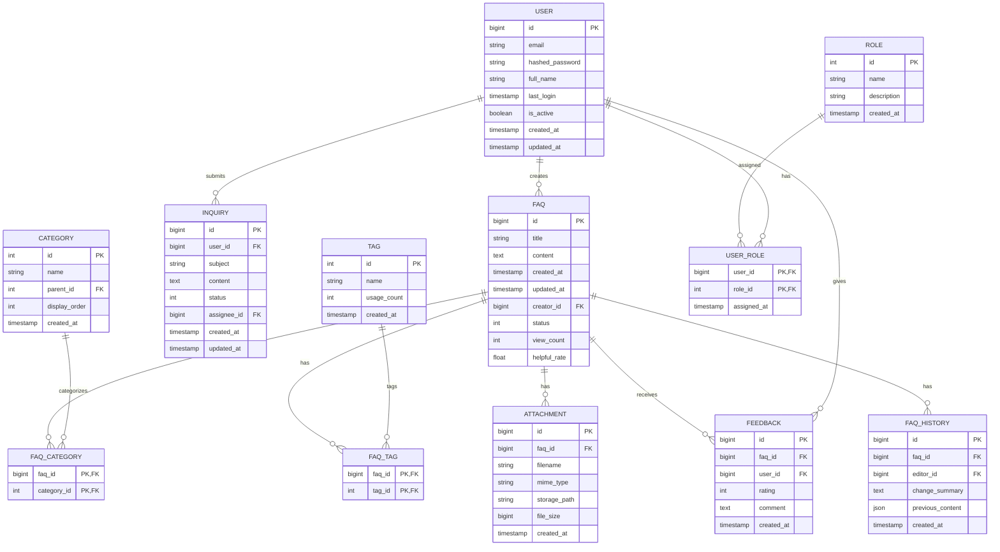

# FAQシステム データベース設計書

## 1. ER図 📊

## 2. テーブル定義 📝

### FAQ
| カラム名 | 型 | NULL | キー | 説明 |
|---------|------|------|------|------|
| id | BIGINT | NO | PK | 主キー |
| title | VARCHAR(200) | NO | - | FAQタイトル |
| content | TEXT | NO | - | FAQ本文 |
| created_at | TIMESTAMP | NO | - | 作成日時 |
| updated_at | TIMESTAMP | NO | - | 更新日時 |
| creator_id | BIGINT | NO | FK | 作成者ID (users.id) |
| status | INTEGER | NO | - | ステータス（0:下書き, 1:公開, 2:非公開） |
| view_count | INTEGER | NO | - | 閲覧数 |
| helpful_rate | FLOAT | YES | - | 有用度（0-1） |

### CATEGORY
| カラム名 | 型 | NULL | キー | 説明 |
|---------|------|------|------|------|
| id | INTEGER | NO | PK | 主キー |
| name | VARCHAR(100) | NO | - | カテゴリ名 |
| parent_id | INTEGER | YES | FK | 親カテゴリID (categories.id) |
| display_order | INTEGER | NO | - | 表示順 |
| created_at | TIMESTAMP | NO | - | 作成日時 |

### FAQ_CATEGORY
| カラム名 | 型 | NULL | キー | 説明 |
|---------|------|------|------|------|
| faq_id | BIGINT | NO | PK,FK | FAQ ID (faqs.id) |
| category_id | INTEGER | NO | PK,FK | カテゴリID (categories.id) |

### TAG
| カラム名 | 型 | NULL | キー | 説明 |
|---------|------|------|------|------|
| id | INTEGER | NO | PK | 主キー |
| name | VARCHAR(50) | NO | - | タグ名 |
| usage_count | INTEGER | NO | - | 使用回数 |
| created_at | TIMESTAMP | NO | - | 作成日時 |

### FAQ_TAG
| カラム名 | 型 | NULL | キー | 説明 |
|---------|------|------|------|------|
| faq_id | BIGINT | NO | PK,FK | FAQ ID (faqs.id) |
| tag_id | INTEGER | NO | PK,FK | タグID (tags.id) |

### ATTACHMENT
| カラム名 | 型 | NULL | キー | 説明 |
|---------|------|------|------|------|
| id | BIGINT | NO | PK | 主キー |
| faq_id | BIGINT | NO | FK | FAQ ID (faqs.id) |
| filename | VARCHAR(255) | NO | - | ファイル名 |
| mime_type | VARCHAR(100) | NO | - | MIMEタイプ |
| storage_path | VARCHAR(500) | NO | - | 保存パス |
| file_size | BIGINT | NO | - | ファイルサイズ(bytes) |
| created_at | TIMESTAMP | NO | - | 作成日時 |

### USER
| カラム名 | 型 | NULL | キー | 説明 |
|---------|------|------|------|------|
| id | BIGINT | NO | PK | 主キー |
| email | VARCHAR(255) | NO | UQ | メールアドレス |
| hashed_password | VARCHAR(255) | NO | - | ハッシュ化パスワード |
| full_name | VARCHAR(100) | NO | - | フルネーム |
| last_login | TIMESTAMP | YES | - | 最終ログイン日時 |
| is_active | BOOLEAN | NO | - | アクティブフラグ |
| created_at | TIMESTAMP | NO | - | 作成日時 |
| updated_at | TIMESTAMP | NO | - | 更新日時 |

### ROLE
| カラム名 | 型 | NULL | キー | 説明 |
|---------|------|------|------|------|
| id | INTEGER | NO | PK | 主キー |
| name | VARCHAR(50) | NO | UQ | ロール名 |
| description | VARCHAR(200) | YES | - | 説明 |
| created_at | TIMESTAMP | NO | - | 作成日時 |

### USER_ROLE
| カラム名 | 型 | NULL | キー | 説明 |
|---------|------|------|------|------|
| user_id | BIGINT | NO | PK,FK | ユーザーID (users.id) |
| role_id | INTEGER | NO | PK,FK | ロールID (roles.id) |
| assigned_at | TIMESTAMP | NO | - | 割り当て日時 |

### FEEDBACK
| カラム名 | 型 | NULL | キー | 説明 |
|---------|------|------|------|------|
| id | BIGINT | NO | PK | 主キー |
| faq_id | BIGINT | NO | FK | FAQ ID (faqs.id) |
| user_id | BIGINT | YES | FK | ユーザーID (users.id) |
| rating | INTEGER | NO | - | 評価（1-5） |
| comment | TEXT | YES | - | コメント |
| created_at | TIMESTAMP | NO | - | 作成日時 |

### INQUIRY
| カラム名 | 型 | NULL | キー | 説明 |
|---------|------|------|------|------|
| id | BIGINT | NO | PK | 主キー |
| user_id | BIGINT | NO | FK | ユーザーID (users.id) |
| subject | VARCHAR(200) | NO | - | 件名 |
| content | TEXT | NO | - | 問合せ内容 |
| status | INTEGER | NO | - | ステータス（0:新規, 1:対応中, 2:解決済み） |
| assignee_id | BIGINT | YES | FK | 担当者ID (users.id) |
| created_at | TIMESTAMP | NO | - | 作成日時 |
| updated_at | TIMESTAMP | NO | - | 更新日時 |

### FAQ_HISTORY
| カラム名 | 型 | NULL | キー | 説明 |
|---------|------|------|------|------|
| id | BIGINT | NO | PK | 主キー |
| faq_id | BIGINT | NO | FK | FAQ ID (faqs.id) |
| editor_id | BIGINT | NO | FK | 編集者ID (users.id) |
| change_summary | TEXT | NO | - | 変更概要 |
| previous_content | JSON | NO | - | 変更前のコンテンツ |
| created_at | TIMESTAMP | NO | - | 作成日時 |

## 3. インデックス定義 🔍

### FAQ
- PRIMARY KEY (id)
- INDEX idx_faq_creator (creator_id)
- INDEX idx_faq_status (status)
- INDEX idx_faq_created (created_at)

### CATEGORY
- PRIMARY KEY (id)
- INDEX idx_category_parent (parent_id)
- INDEX idx_category_order (display_order)

### FAQ_CATEGORY
- PRIMARY KEY (faq_id, category_id)
- INDEX idx_faqcategory_category (category_id)

### TAG
- PRIMARY KEY (id)
- UNIQUE INDEX unq_tag_name (name)
- INDEX idx_tag_usage (usage_count)

### FAQ_TAG
- PRIMARY KEY (faq_id, tag_id)
- INDEX idx_faqtag_tag (tag_id)

### USER
- PRIMARY KEY (id)
- UNIQUE INDEX unq_user_email (email)
- INDEX idx_user_status (is_active)

### FEEDBACK
- PRIMARY KEY (id)
- INDEX idx_feedback_faq (faq_id)
- INDEX idx_feedback_user (user_id)
- INDEX idx_feedback_created (created_at)

### INQUIRY
- PRIMARY KEY (id)
- INDEX idx_inquiry_user (user_id)
- INDEX idx_inquiry_assignee (assignee_id)
- INDEX idx_inquiry_status (status)
- INDEX idx_inquiry_created (created_at)

## 4. 制約定義 🔒

### 外部キー制約
- FAQ.creator_id → USER.id (CASCADE)
- FAQ_CATEGORY.faq_id → FAQ.id (CASCADE)
- FAQ_CATEGORY.category_id → CATEGORY.id (RESTRICT)
- FAQ_TAG.faq_id → FAQ.id (CASCADE)
- FAQ_TAG.tag_id → TAG.id (RESTRICT)
- FEEDBACK.faq_id → FAQ.id (CASCADE)
- FEEDBACK.user_id → USER.id (SET NULL)
- INQUIRY.user_id → USER.id (RESTRICT)
- INQUIRY.assignee_id → USER.id (SET NULL)

### チェック制約
- FEEDBACK.rating: CHECK (rating BETWEEN 1 AND 5)
- FAQ.helpful_rate: CHECK (helpful_rate BETWEEN 0 AND 1)
- INQUIRY.status: CHECK (status IN (0, 1, 2))
- FAQ.status: CHECK (status IN (0, 1, 2))

## 5. パーティション戦略 📊

### FAQ
- 月次パーティション（created_at基準）
- 保持期間：永続

### FEEDBACK
- 月次パーティション（created_at基準）
- 保持期間：2年

### INQUIRY
- 月次パーティション（created_at基準）
- 保持期間：3年

## 6. バックアップ戦略 💾

### 完全バックアップ
- 実行頻度：毎日深夜1時
- 保持期間：30日分
- 暗号化：AES-256

### 差分バックアップ
- 実行頻度：1時間毎
- 保持期間：24時間分
- 暗号化：AES-256

### アーカイブログ
- WALアーカイブ
- 保持期間：7日分