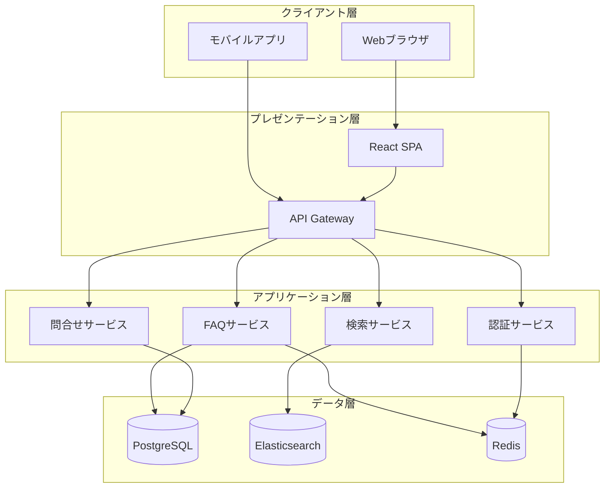
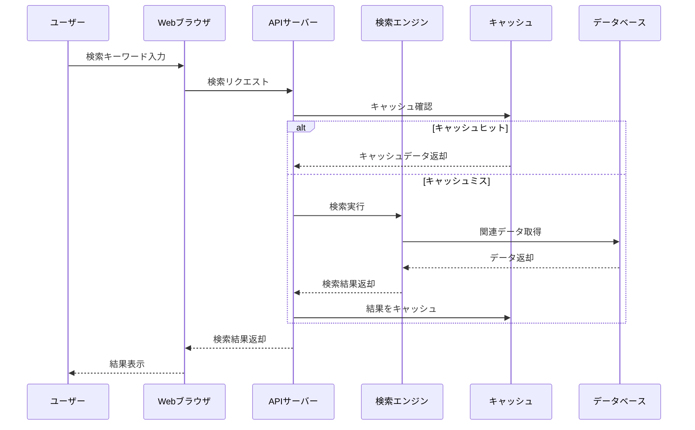
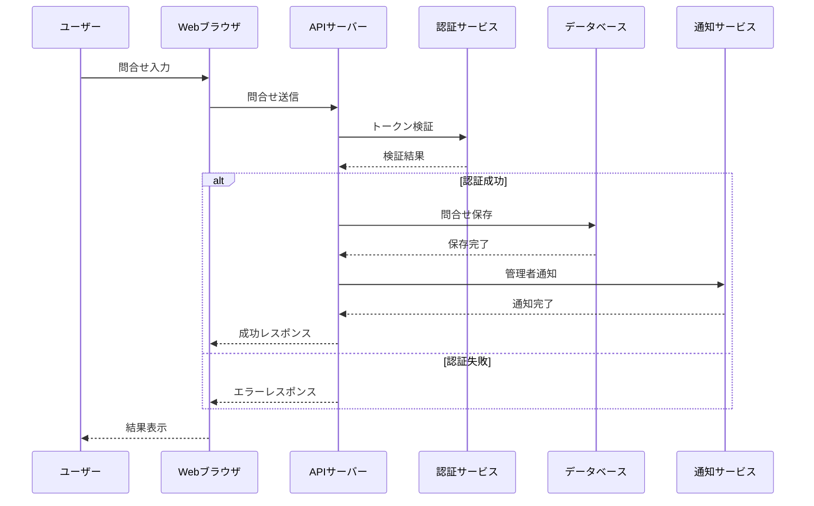
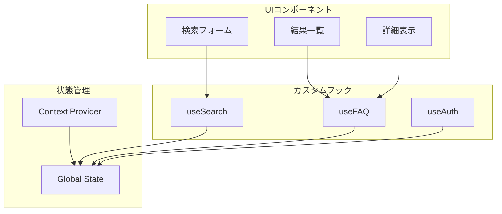
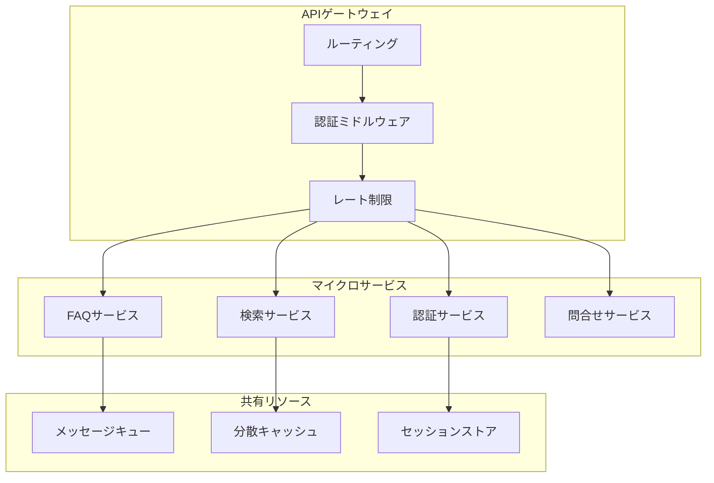
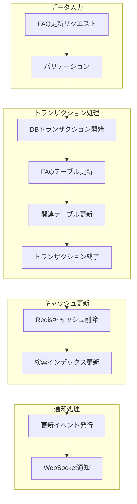
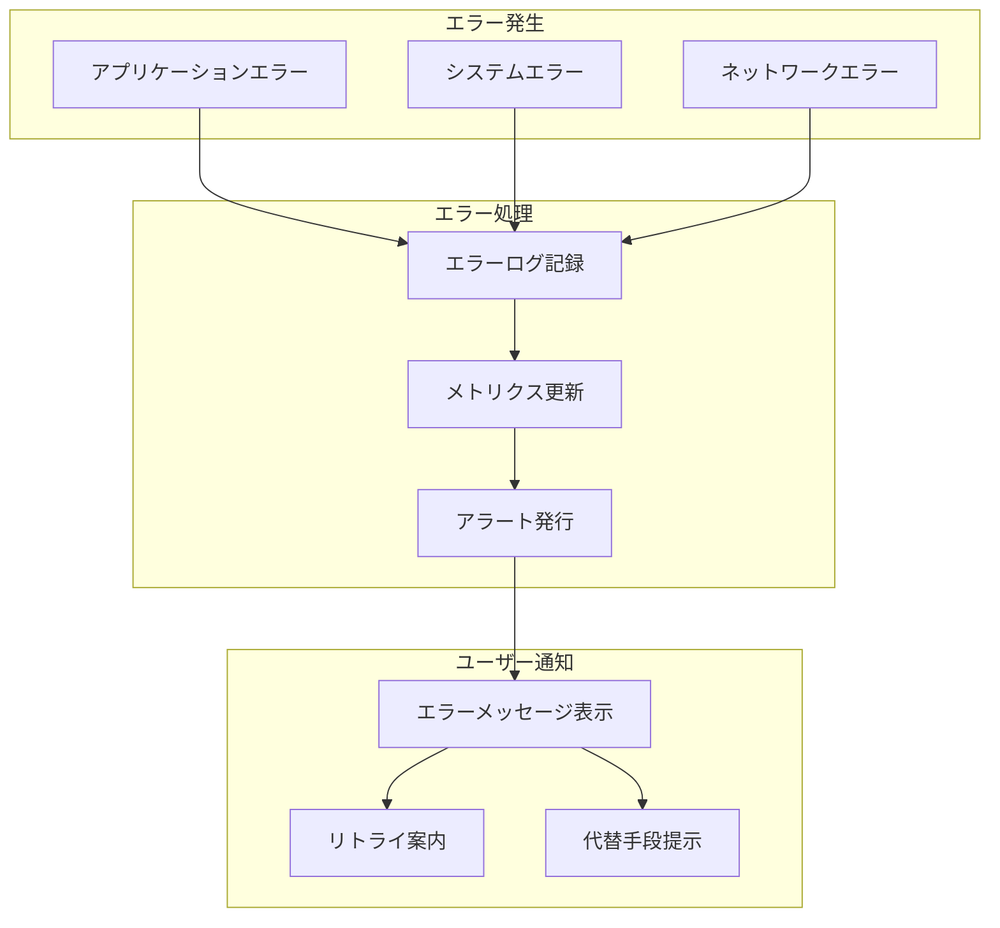
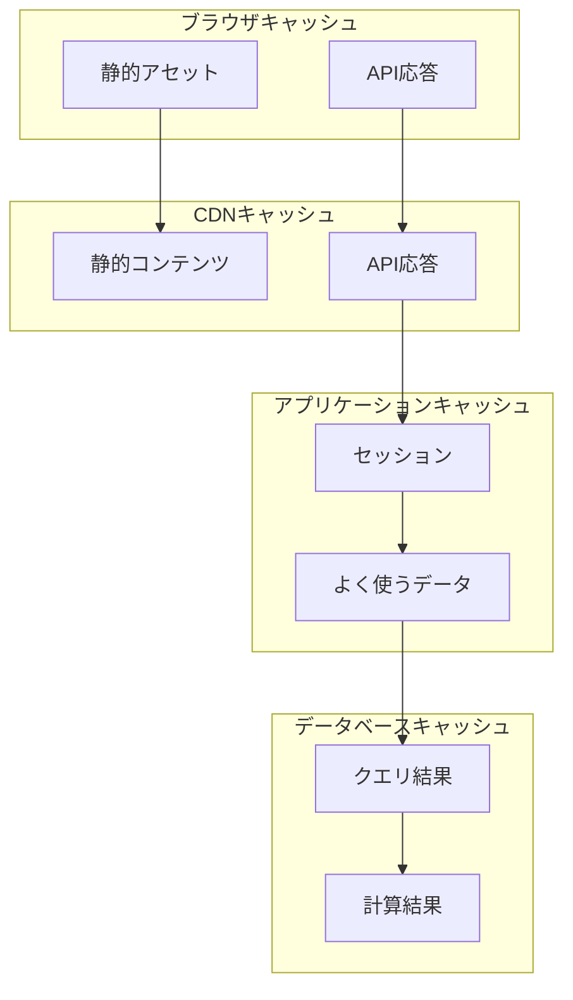
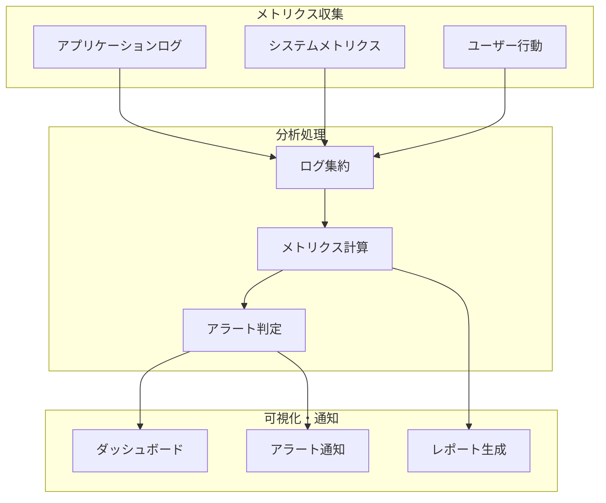

# FAQシステム データフロー設計書

## 1. システム全体のデータフロー 🔄



## 2. 主要機能のシーケンス図 📊

### FAQ検索プロセス



### 問合せ作成プロセス



## 3. コンポーネント間通信フロー 🔄

### フロントエンド コンポーネント通信



### バックエンド サービス間通信



## 4. データ処理フロー 📊

### FAQ更新プロセス



## 5. エラーハンドリングフロー ⚠️



## 6. キャッシュ戦略 💾

### キャッシュレイヤー



## 7. 監視フロー 📈



## 8. バックアップ・リストアフロー 🔄

```mermaid
graph TD
    subgraph "バックアップ処理"
        A[フルバックアップ]
        B[差分バックアップ]
        C[ログバックアップ]
    end
    
    subgraph "バックアップ保存"
        D[オブジェクトストレージ]
        E[アーカイブストレージ]
    end
    
    subgraph "リストア処理"
        F[フルリストア]
        G[差分適用]
        H[ログ適用]
    end
    
    A --> D
    B --> D
    C --> E
    D --> F
    D --> G
    E --> H