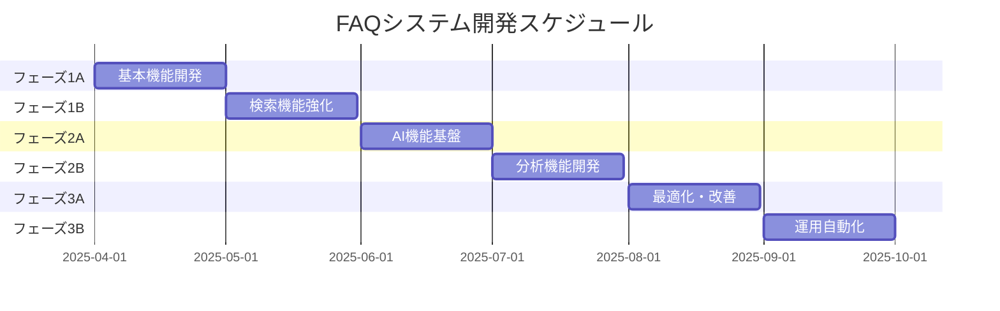

# 実装フェーズ計画書

## 1. 📅 全体スケジュール

## 2. 🎯 フェーズ詳細

### フェーズ1A：基本機能開発（4週間）
- **目的**: 最小限の実用的なFAQシステムの構築

#### 週別計画
1. **第1週**
   - ユーザー認証基盤構築
   - 基本的なFAQ CRUD機能
   - 問合せフォーム基本機能

2. **第2週**
   - カテゴリ/タグ管理機能
   - 権限管理システム
   - チケット管理基本機能

3. **第3週**
   - アタッチメント機能
   - バージョン管理機能
   - 問合せ対応管理機能

4. **第4週**
   - UIの改善
   - バグ修正
   - 初期テスト

#### 成果物
- 基本的なFAQ管理システム
- 問合せ管理システム
- ユーザー認証システム
- 権限管理システム

### フェーズ1B：検索機能強化（4週間）
- **目的**: 高度な検索機能の実装

#### 週別計画
1. **第1週**
   - Elasticsearch導入
   - インデックス設計
   - 基本検索機能実装

2. **第2週**
   - 高度な検索機能実装
   - フィルタリング機能
   - ソート機能

3. **第3週**
   - 検索結果最適化
   - キャッシュ導入
   - パフォーマンスチューニング

4. **第4週**
   - UI/UX改善
   - 検索統計機能
   - テスト・バグ修正

#### 成果物
- 高度な検索システム
- 検索パフォーマンス最適化
- 検索分析基盤

### フェーズ2A：AI機能基盤（4週間）
- **目的**: AIチャットボットの基本機能実装

#### 週別計画
1. **第1週**
   - AI基盤構築
   - 基本的な対話機能
   - NLP機能実装

2. **第2週**
   - FAQ連携機能
   - 文脈理解機能
   - 回答生成機能

3. **第3週**
   - 対話フロー最適化
   - エラーハンドリング
   - パフォーマンス改善

4. **第4週**
   - UI/UX改善
   - テスト・評価
   - フィードバック収集

#### 成果物
- 基本的なチャットボット
- FAQ連携システム
- 対話管理システム

### フェーズ2B：分析機能開発（4週間）
- **目的**: データ分析・レポート機能の実装

#### 週別計画
1. **第1週**
   - 分析基盤構築
   - データ収集システム
   - 基本レポート機能

2. **第2週**
   - 高度な分析機能
   - ダッシュボード開発
   - データ可視化

3. **第3週**
   - レポート自動生成
   - アラート機能
   - 予測分析

4. **第4週**
   - UI/UX改善
   - パフォーマンス最適化
   - ドキュメント作成

#### 成果物
- 分析ダッシュボード
- レポート生成システム
- 予測分析機能

### フェーズ3A：最適化・改善（4週間）
- **目的**: システム全体の最適化と改善

#### 週別計画
1. **第1週**
   - パフォーマンス分析
   - ボトルネック特定
   - 改善計画策定

2. **第2週**
   - キャッシュ最適化
   - クエリ最適化
   - スケーラビリティ改善

3. **第3週**
   - セキュリティ強化
   - 監視体制強化
   - 障害対策改善

4. **第4週**
   - 総合テスト
   - 性能評価
   - ドキュメント更新

#### 成果物
- 最適化されたシステム
- 改善された監視体制
- 更新されたドキュメント

### フェーズ3B：運用自動化（4週間）
- **目的**: 運用・保守の自動化

#### 週別計画
1. **第1週**
   - CI/CD整備
   - 自動テスト強化
   - デプロイ自動化

2. **第2週**
   - 監視自動化
   - バックアップ自動化
   - アラート自動化

3. **第3週**
   - 運用ツール開発
   - 管理機能改善
   - 手順書作成

4. **第4週**
   - 総合テスト
   - 運用訓練
   - ドキュメント完成

#### 成果物
- 自動化された運用体制
- 運用ツール群
- 完全な運用ドキュメント

## 3. 🎮 各フェーズの評価基準

### フェーズ1
- **定量指標**
  - 基本機能の完成度：100%
  - 検索応答時間：1秒以内
  - テストカバレッジ：80%以上

- **定性指標**
  - ユーザーインターフェースの使いやすさ
  - システムの安定性
  - コードの保守性

### フェーズ2
- **定量指標**
  - AI応答の正確性：85%以上
  - 分析レポートの自動化率：90%以上
  - システム稼働率：99.9%以上

- **定性指標**
  - AI応答の自然さ
  - 分析情報の有用性
  - システムの拡張性

### フェーズ3
- **定量指標**
  - 運用作業の自動化率：80%以上
  - 障害復旧時間：30分以内
  - システムパフォーマンス改善率：50%以上

- **定性指標**
  - 運用の効率性
  - システムの信頼性
  - ドキュメントの完全性

## 4. 🔄 フィードバックサイクル

### 各フェーズでの改善プロセス
1. **計画（Plan）**
   - 要件の詳細化
   - タスクの優先順位付け
   - リソース配分

2. **実行（Do）**
   - 機能実装
   - テスト実施
   - ドキュメント作成

3. **評価（Check）**
   - 性能測定
   - ユーザーフィードバック
   - 品質評価

4. **改善（Act）**
   - 問題点の修正
   - 最適化の実施
   - プロセスの改善

### フィードバック収集方法
- ユーザーインタビュー
- システムログ分析
- パフォーマンスモニタリング
- 運用統計の収集

## 5. ⚠️ リスク管理

### 想定されるリスク
1. **技術的リスク**
   - 性能要件未達
   - 統合の問題
   - セキュリティ脆弱性

2. **スケジュールリスク**
   - 開発遅延
   - リソース不足
   - 要件変更

3. **運用リスク**
   - システム障害
   - データ損失
   - 人的ミス

### 対策
1. **技術的対策**
   - 事前検証の徹底
   - 段階的な導入
   - 定期的な脆弱性診断

2. **スケジュール対策**
   - バッファの確保
   - マイルストーンの細分化
   - 優先順位の明確化

3. **運用対策**
   - 監視体制の強化
   - バックアップの確保
   - 運用手順の整備