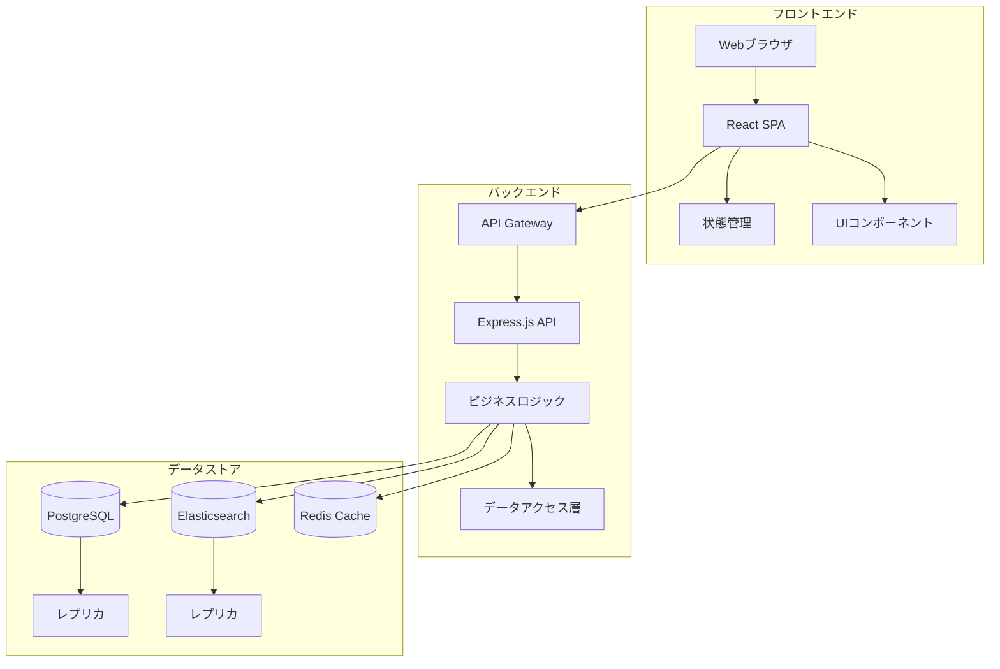

# FAQシステム 機能要件定義書

## 1. 🎯 システム概要

### 目的
- カスタマーサポート業務の効率化
- ユーザーのセルフサービス解決率向上
- ナレッジの一元管理と活用促進

### システム構成

## 2. 🎭 ユーザー定義

### エンドユーザー
- **一般ユーザー**
  - 製品・サービスの利用者
  - FAQ閲覧、検索が主な利用目的
  - 技術レベルは様々

- **登録ユーザー**
  - アカウント作成済みユーザー
  - 問合せ履歴の確認や状態管理が可能
  - フィードバック機能の利用が可能

### 管理者
- **コンテンツ管理者**
  - FAQ記事の作成・編集・管理
  - カテゴリ・タグの管理
  - コンテンツの品質管理

- **システム管理者**
  - ユーザー管理
  - システム設定管理
  - 権限管理
  - 統計・分析

## 3. 💡 機能要件

### 3.1 コンテンツ管理機能
#### FAQ記事管理
- **作成・編集**
  - リッチテキストエディタによる記事作成
  - 画像・動画等のメディア管理
  - 下書き保存機能
  - バージョン管理
  
- **分類・整理**
  - カテゴリ管理（最大3階層）
  - タグ付け（最大10個/記事）
  - 関連記事の紐付け
  
- **公開制御**
  - 公開/非公開設定
  - 公開スケジュール管理
  - アクセス制限設定

#### コンテンツ最適化
- **SEO対策**
  - メタデータ管理
  - サイトマップ生成
  - OGP設定
  
- **品質管理**
  - コンテンツレビュー機能
  - 校正支援機能
  - 重複チェック機能

### 3.2 検索・ナビゲーション機能
#### 検索機能
- **クイック検索**
  - インクリメンタル検索
  - サジェスト機能
  - スペルチェック
  
- **詳細検索**
  - カテゴリ/タグによる絞り込み
  - 日付範囲指定
  - キーワードの組み合わせ検索
  
- **検索結果**
  - 関連度順表示
  - プレビュー表示
  - フィルタリングオプション

#### ナビゲーション
- **カテゴリナビゲーション**
  - カテゴリツリー表示
  - パンくずリスト
  - カテゴリ別記事一覧
  
- **関連コンテンツ**
  - 関連FAQ表示
  - 人気記事表示
  - 最近見た記事

### 3.3 AI支援機能
#### チャットボット
- **自動応答**
  - 自然言語による質問理解
  - FAQ内容に基づく回答生成
  - 関連FAQの提案
  
- **対話管理**
  - 文脈を考慮した会話維持
  - 質問意図の明確化
  - エスカレーションフロー

#### コンテンツ分析
- **トレンド分析**
  - よくある質問の自動抽出
  - 未回答質問の分析
  - 季節性トレンドの検出
  
- **品質改善**
  - わかりにくい表現の検出
  - 改善提案の自動生成
  - 用語の統一提案

### 3.4 統計・分析機能
#### アクセス分析
- **利用統計**
  - ページビュー/UU
  - 滞在時間
  - 直帰率
  
- **検索分析**
  - 検索キーワードランキング
  - ノーヒットワード分析
  - 検索導線分析

#### 効果測定
- **解決率分析**
  - セルフサービス解決率
  - 記事別有用度
  - フィードバック分析
  
- **ROI分析**
  - コスト削減効果
  - 工数削減効果
  - 顧客満足度影響

### 3.5 システム管理機能
#### ユーザー管理
- **アカウント管理**
  - ユーザー登録/編集
  - 権限設定
  - アクセス履歴管理
  
- **認証・認可**
  - マルチファクタ認証
  - シングルサインオン
  - セッション管理

#### システム設定
- **基本設定**
  - サイト設定
  - メール設定
  - 通知設定
  
- **連携設定**
  - 外部システム連携
  - API設定
  - インポート/エクスポート
  
### 3.6 問合せ管理機能
#### 問合せフォーム
- **入力機能**
  - 必須項目の入力（氏名、メールアドレス、件名、内容）
  - 任意項目の入力（電話番号、会社名）
  - 添付ファイル機能（最大5ファイル、1ファイル10MB以内）
  - プレビュー・一時保存機能
  
- **バリデーション**
  - 入力形式チェック
  - 文字数制限チェック
  - 添付ファイル制限チェック
  - CAPTCHA認証

#### チケット管理
- **ステータス管理**
  - 新規受付
  - 対応中
  - 保留
  - 解決済み
  - クローズ

- **優先度管理**
  - 緊急（2時間以内）
  - 高（24時間以内）
  - 中（3営業日以内）
  - 低（5営業日以内）

- **担当者管理**
  - 自動アサイン機能
  - 手動アサイン機能
  - 担当者変更履歴管理
  - 負荷分散管理

#### 対応管理
- **コミュニケーション**
  - 内部メモ機能
  - 返信テンプレート機能
  - メール通知機能
  - 一括返信機能

- **履歴管理**
  - 対応履歴の記録
  - ステータス変更履歴
  - 添付ファイル履歴
  - 関連FAQのリンク

#### レポーティング
- **問合せ分析**
  - カテゴリ別集計
  - 対応時間分析
  - 解決率分析
  - トレンド分析

- **パフォーマンス管理**
  - 応答時間統計
  - 担当者別対応件数
  - SLA遵守率
  - 顧客満足度

#### FAQ連携
- **ナレッジベース化**
  - FAQ作成提案
  - 類似問合せの紐付け
  - 回答テンプレート作成
  - 効果測定

- **自動化機能**
  - 類似FAQ自動表示
  - 回答候補の提示
  - カテゴリ自動分類
  - 優先度自動判定

## 4. 🔒 非機能要件

### 4.1 性能要件
- **レスポンス時間**
  - ページロード：2秒以内
  - 検索結果表示：1秒以内
  - API応答：200ms以内

- **同時接続**
  - 最大1000ユーザー
  - ピーク時のスケーリング対応

### 4.2 セキュリティ要件
- **認証・認可**
  - JWTによる認証
  - RBACによる権限制御
  - セッション管理

- **データ保護**
  - TLS 1.3による通信暗号化
  - データベース暗号化
  - 個人情報のマスキング

### 4.3 可用性要件
- **稼働時間**
  - 24時間365日運用
  - 計画メンテナンス時間を除く
  
- **バックアップ**
  - 日次フルバックアップ
  - 1時間毎の差分バックアップ
  - 30日間の世代管理

### 4.4 保守性要件
- **モニタリング**
  - リソース監視
  - エラー監視
  - パフォーマンス監視
  
- **ログ管理**
  - アクセスログ
  - エラーログ
  - 監査ログ

## 5. 📈 開発ロードマップ

### フェーズ1（2ヶ月）
- 基本的なFAQ管理機能
- 検索機能
- ユーザー管理

### フェーズ2（2ヶ月）
- AI支援機能
- 統計・分析機能
- API連携機能

### フェーズ3（2ヶ月）
- 高度な検索機能
- パフォーマンス最適化
- 運用自動化

## 6. ⚖️ 制約条件

### 技術的制約
- フロントエンド：React + TypeScript
- バックエンド：Express.js + TypeScript
- データベース：PostgreSQL
- 検索エンジン：Elasticsearch
- キャッシュ：Redis

### 予算制約
- 開発費：2000万円
- 運用保守費：500万円/年
- ライセンス費：100万円/年

### スケジュール制約
- 開発期間：6ヶ月
- 要件定義：1ヶ月
- 設計：1.5ヶ月
- 実装：2.5ヶ月
- テスト：1ヶ月