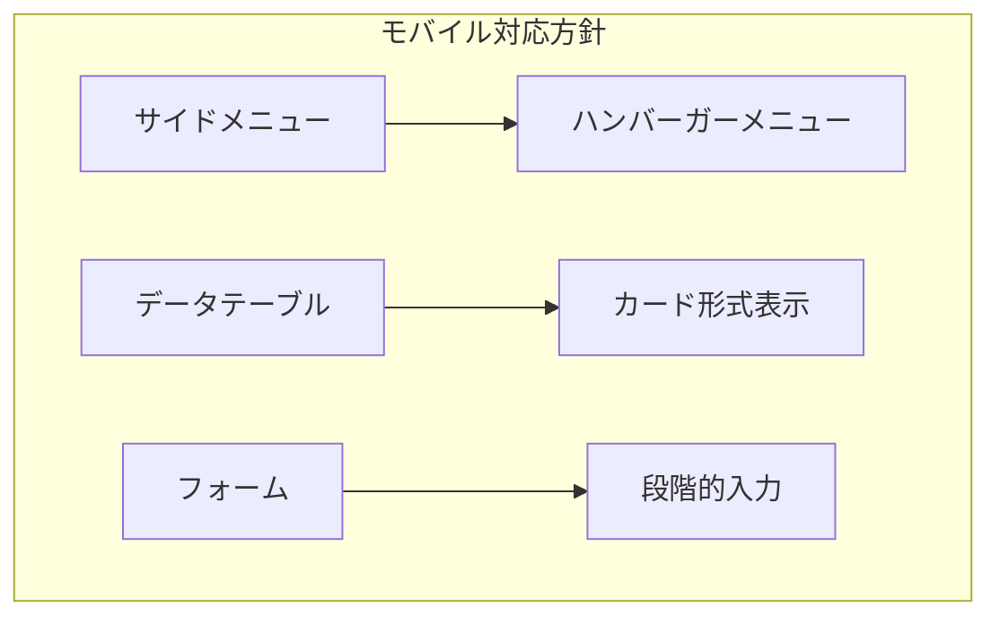
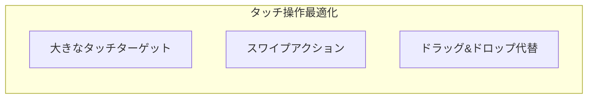
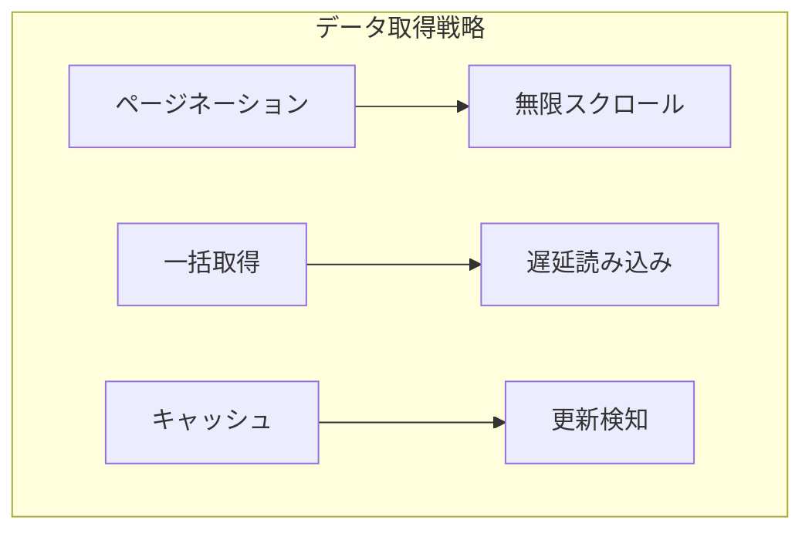

# FAQ管理システム 管理画面ワイヤーフレーム

## 1. 管理画面共通レイアウト 🏗️

```plaintext
+----------------------------------+
|            ヘッダー               |
|  ロゴ        通知  ユーザー情報   |
+----------------------------------+
|      |                          |
| サイド|    コンテンツエリア       |
| メニュー|                        |
| ・ダッシュ|                      |
| ・FAQ  |                        |
| ・カテゴリ|                      |
| ・問合せ |                      |
| ・ユーザー|                      |
| ・統計  |                        |
| ・設定  |                        |
|      |                          |
+----------------------------------+
```

## 2. FAQ編集画面 📝

### 2.1 FAQ作成/編集フォーム

```plaintext
+----------------------------------+
|        FAQ作成/編集              |
+----------------------------------+
| タイトル                         |
| +------------------------------+ |
| |                              | |
| +------------------------------+ |
|                                  |
| カテゴリ選択                     |
| +------------------------------+ |
| | [階層型セレクトボックス]      | |
| +------------------------------+ |
|                                  |
| タグ管理                         |
| +------------------------------+ |
| | [タグ入力＆チップ表示]        | |
| +------------------------------+ |
|                                  |
| 本文エディタ                     |
| +------------------------------+ |
| | [ツールバー]                  | |
| | ・見出し                      | |
| | ・リスト                      | |
| | ・テーブル                    | |
| | ・画像挿入                    | |
| | ・リンク                      | |
| +------------------------------+ |
| | [エディタ本文]                | |
| |                              | |
| |                              | |
| +------------------------------+ |
|                                  |
| メタ情報                         |
| ・公開状態: [公開/下書き]        |
| ・公開日時: [日時選択]           |
| ・更新者: [自動表示]             |
|                                  |
| +------------------------------+ |
| | [プレビュー]                  | |
| +------------------------------+ |
|                                  |
| [保存] [プレビュー] [キャンセル]  |
+----------------------------------+
```

### 2.2 FAQプレビューモード

```plaintext
+----------------------------------+
|        FAQプレビュー             |
+----------------------------------+
| プレビューモード選択              |
| [PC] [タブレット] [スマートフォン] |
+----------------------------------+
| +------------------------------+ |
| |      プレビュー表示          | |
| |                              | |
| | [実際のFAQ表示イメージ]      | |
| |                              | |
| +------------------------------+ |
|                                  |
| [編集に戻る] [公開する]          |
+----------------------------------+
```

## 3. カテゴリ管理画面 📁

### 3.1 カテゴリツリー管理

```plaintext
+----------------------------------+
|        カテゴリ管理              |
+----------------------------------+
| [新規カテゴリ作成]               |
|                                  |
| カテゴリツリー                   |
| +------------------------------+ |
| | ▼ カテゴリ1                  | |
| |   ▶ サブカテゴリ1.1          | |
| |   ▶ サブカテゴリ1.2          | |
| | ▼ カテゴリ2                  | |
| |   ▶ サブカテゴリ2.1          | |
| +------------------------------+ |
|                                  |
| ドラッグ＆ドロップで順序変更可能  |
+----------------------------------+
```

### 3.2 カテゴリ編集フォーム

```plaintext
+----------------------------------+
|        カテゴリ編集              |
+----------------------------------+
| カテゴリ名                       |
| +------------------------------+ |
| |                              | |
| +------------------------------+ |
|                                  |
| 親カテゴリ                       |
| +------------------------------+ |
| | [選択式]                      | |
| +------------------------------+ |
|                                  |
| 説明                            |
| +------------------------------+ |
| |                              | |
| +------------------------------+ |
|                                  |
| SEO設定                         |
| ・メタタイトル                   |
| ・メタディスクリプション          |
| ・OGP画像                       |
|                                  |
| [保存] [削除] [キャンセル]       |
+----------------------------------+
```

## 4. 統計・分析画面 📊

### 4.1 ダッシュボード概要

```plaintext
+----------------------------------+
|        統計ダッシュボード         |
+----------------------------------+
| 期間選択: [今日/週間/月間/カスタム]|
+----------------------------------+
| アクセス統計                      |
| +------------------------------+ |
| |   [アクセス数推移グラフ]      | |
| |                              | |
| +------------------------------+ |
|                                  |
| FAQ効果測定                      |
| +--------+  +--------+          |
| |閲覧数  |  |解決率  |          |
| |トップ10|  |低い記事|          |
| +--------+  +--------+          |
|                                  |
| 検索分析                         |
| +--------+  +--------+          |
| |検索    |  |未回答  |          |
| |キーワード|  |質問   |          |
| +--------+  +--------+          |
+----------------------------------+
```

### 4.2 詳細分析画面

```plaintext
+----------------------------------+
|        詳細分析                  |
+----------------------------------+
| フィルター条件                    |
| ・期間: [期間選択]               |
| ・カテゴリ: [複数選択可]         |
| ・デバイス: [PC/モバイル/全て]    |
+----------------------------------+
| クロス分析                       |
| +------------------------------+ |
| |   [クロス集計テーブル]        | |
| |                              | |
| +------------------------------+ |
|                                  |
| データエクスポート               |
| [CSV出力] [PDF出力]              |
+----------------------------------+
```

## 5. ユーザー管理画面 👥

### 5.1 ユーザー一覧

```plaintext
+----------------------------------+
|        ユーザー管理              |
+----------------------------------+
| [新規ユーザー作成]               |
|                                  |
| 検索/フィルター                  |
| +------------------------------+ |
| | 検索バー                      | |
| +------------------------------+ |
| ・ステータス: [有効/無効/全て]    |
| ・ロール: [複数選択可]           |
|                                  |
| ユーザー一覧                     |
| +------------------------------+ |
| | [ユーザー情報テーブル]        | |
| | ・名前                        | |
| | ・メール                      | |
| | ・ロール                      | |
| | ・最終ログイン                | |
| | ・ステータス                  | |
| | ・アクション                  | |
| +------------------------------+ |
+----------------------------------+
```

### 5.2 権限設定画面

```plaintext
+----------------------------------+
|        権限設定                  |
+----------------------------------+
| ロール選択                       |
| [管理者/編集者/閲覧者]           |
|                                  |
| 権限マトリックス                 |
| +------------------------------+ |
| | 機能        | 権限          | |
| |------------|---------------| |
| | FAQ作成     | [権限レベル]  | |
| | FAQ編集     | [権限レベル]  | |
| | FAQ削除     | [権限レベル]  | |
| | カテゴリ管理 | [権限レベル]  | |
| | ユーザー管理 | [権限レベル]  | |
| | 統計閲覧    | [権限レベル]  | |
| +------------------------------+ |
|                                  |
| [保存] [リセット]                |
+----------------------------------+
```

## 6. システム設定画面 ⚙️

### 6.1 一般設定

```plaintext
+----------------------------------+
|        システム設定              |
+----------------------------------+
| サイト設定                       |
| ・サイト名                       |
| ・ロゴ画像                       |
| ・favicon                        |
|                                  |
| 表示設定                         |
| ・1ページの表示件数              |
| ・新着FAQ表示期間               |
| ・関連FAQ表示件数               |
|                                  |
| メール設定                       |
| ・送信元メールアドレス           |
| ・メールテンプレート             |
|                                  |
| API設定                         |
| ・APIキー管理                   |
| ・Webhook設定                   |
|                                  |
| [保存] [設定をエクスポート]      |
+----------------------------------+
```

### 6.2 セキュリティ設定

```plaintext
+----------------------------------+
|        セキュリティ設定          |
+----------------------------------+
| アクセス制限                     |
| ・IP制限                        |
| ・2要素認証設定                  |
| ・パスワードポリシー             |
|                                  |
| セッション管理                   |
| ・セッションタイムアウト         |
| ・同時ログイン制限               |
|                                  |
| バックアップ設定                 |
| ・自動バックアップ               |
| ・保持期間                       |
|                                  |
| [保存] [テスト実行]              |
+----------------------------------+
```

## 7. レスポンシブ対応 📱

### 7.1 モバイル表示調整



### 7.2 タッチインターフェース



## 8. アクセシビリティ対応 ♿

### 8.1 管理画面アクセシビリティ

```yaml
キーボード操作:
  - ショートカットキー
  - フォーカス順序
  - スキップリンク

支援技術対応:
  - ARIAランドマーク
  - フォーム説明
  - エラー通知
```

## 9. パフォーマンス最適化 🚀

### 9.1 データ読み込み最適化



### 9.2 レスポンス改善

```yaml
最適化施策:
  - データのプリフェッチ
  - インクリメンタル更新
  - バックグラウンド同期
  - オフライン対応