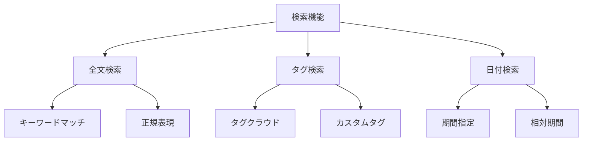
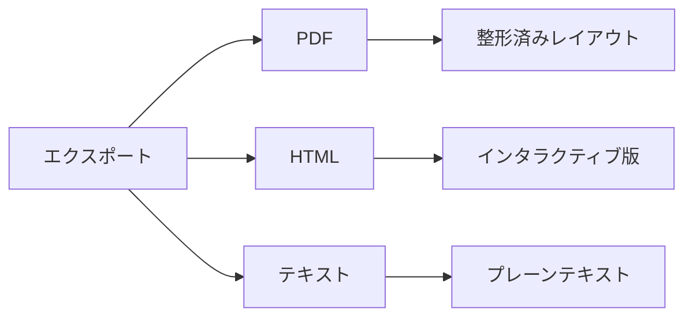
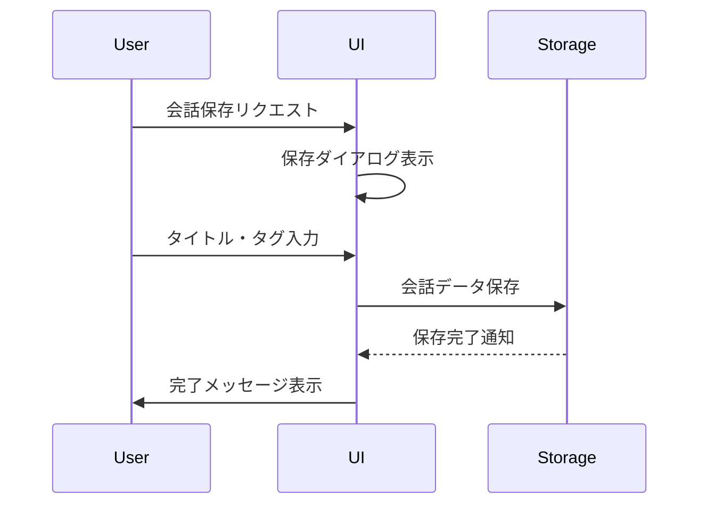
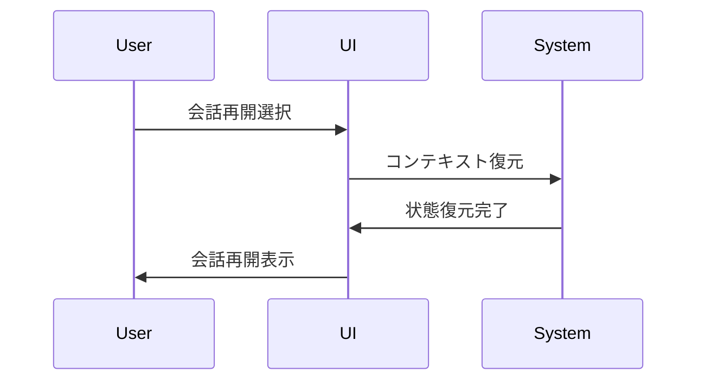
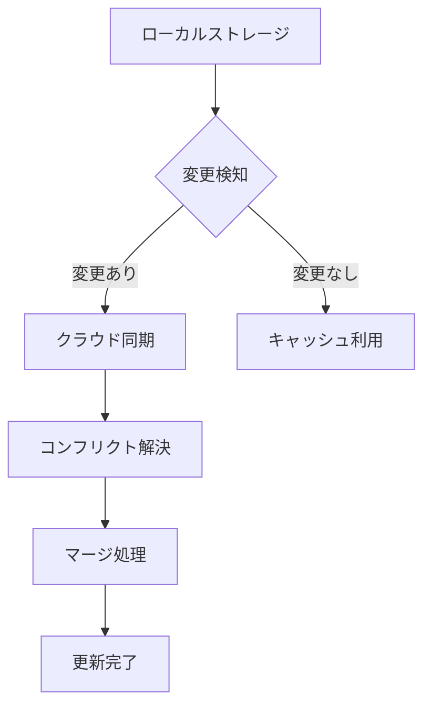

# チャットボット履歴管理機能 設計書

## 1. 履歴管理パネル 📋

```plaintext
+------------------------------------------------+
|                  ヘッダー                       |
| [履歴] チャット履歴管理              [設定] [?] |
+------------------------------------------------+
|  検索/フィルター  |        履歴詳細表示         |
| +----------------+ +----------------------------+|
| | 🔍 検索       | | 会話タイトル               ||
| +----------------+ | 日時: 2025/03/24 13:00    ||
| |                | | タグ: #問合せ #機能確認   ||
| | フィルター     | |                           ||
| | ◉ すべて      | | +------------------------+||
| | ○ 保存済み    | | | ユーザー:              |||
| | ○ 未解決      | | | 質問内容...            |||
| | ○ 解決済み    | | +------------------------+||
| |                | |                           ||
| | 期間          | | +------------------------+||
| | [日付範囲選択] | | | AI:                   |||
| |                | | | 回答内容...           |||
| | タグ          | | +------------------------+||
| | [タグ選択]    | |                           ||
| |                | | [会話を再開] [エクスポート]||
| +----------------+ +----------------------------+|
|                  |                              |
| 履歴リスト       |       操作パネル            |
| +----------------+ +----------------------------+|
| | 2025/03/24    | | [選択した会話をエクスポート]||
| | 13:00         | | 形式:                      ||
| | 機能について   | | ○ PDF                     ||
| +----------------+ | ○ HTML                    ||
| | 2025/03/24    | | ○ テキスト                ||
| | 12:30         | |                           ||
| | 設定確認      | | [まとめてエクスポート]     ||
| +----------------+ +----------------------------+|
+------------------------------------------------+
```

## 2. 検索・フィルター機能 🔍

### 2.1 検索オプション



### 2.2 フィルターロジック

```yaml
フィルター条件:
  状態:
    - すべて
    - 保存済み
    - 未解決
    - 解決済み
  
  期間:
    - 今日
    - 過去7日
    - 過去30日
    - カスタム期間
  
  タグ:
    - システム定義タグ
    - ユーザー定義タグ
    - 自動分類タグ
```

## 3. エクスポート機能 📤

### 3.1 エクスポート形式



### 3.2 エクスポート設定

```yaml
PDF設定:
  - ヘッダー/フッター
  - ページ番号
  - 目次生成
  - メタデータ

HTML設定:
  - スタイルシート
  - 画像埋め込み
  - スクリプト
  - レスポンシブ対応

テキスト設定:
  - 文字コード
  - 改行コード
  - フォーマット
```

## 4. 会話の保存・再開機能 💾

### 4.1 保存機能



### 4.2 再開機能



## 5. レスポンシブ対応 📱

### 5.1 モバイルレイアウト

```plaintext
+----------------------+
|       ヘッダー       |
| [≡] 履歴管理 [検索] |
+----------------------+
|    フィルターバー    |
| [すべて ▼] [期間 ▼] |
+----------------------+
|     履歴リスト      |
| +------------------+ |
| | 2025/03/24      | |
| | 13:00           | |
| | 機能について     | |
| +------------------+ |
| | 2025/03/24      | |
| | 12:30           | |
| | 設定確認        | |
| +------------------+ |
|                      |
| [選択した会話を表示] |
+----------------------+
```

## 6. アクセシビリティ対応 ♿

### 6.1 キーボードナビゲーション

```yaml
ショートカットキー:
  検索:
    - 検索窓フォーカス: Ctrl/Cmd + F
    - 検索実行: Enter
  
  履歴操作:
    - 次の項目: ↓
    - 前の項目: ↑
    - 選択: Space/Enter
    - 詳細表示: →
    - 一覧に戻る: ←

  その他:
    - エクスポート: Ctrl/Cmd + E
    - 保存: Ctrl/Cmd + S
    - 再開: Ctrl/Cmd + O
```

## 7. パフォーマンス最適化 🚀

### 7.1 データ読み込み戦略

```yaml
最適化手法:
  - 仮想スクロール
  - ページング処理
  - インクリメンタル検索
  - キャッシュ活用

ローディング制御:
  - スケルトンUI
  - プログレスインジケータ
  - バックグラウンド読み込み
```

## 8. データ同期 🔄

### 8.1 同期メカニズム



### 8.2 オフライン対応

```yaml
オフライン機能:
  - ローカルデータ保存
  - 変更のキューイング
  - 自動同期再開
  - コンフリクト解決UI