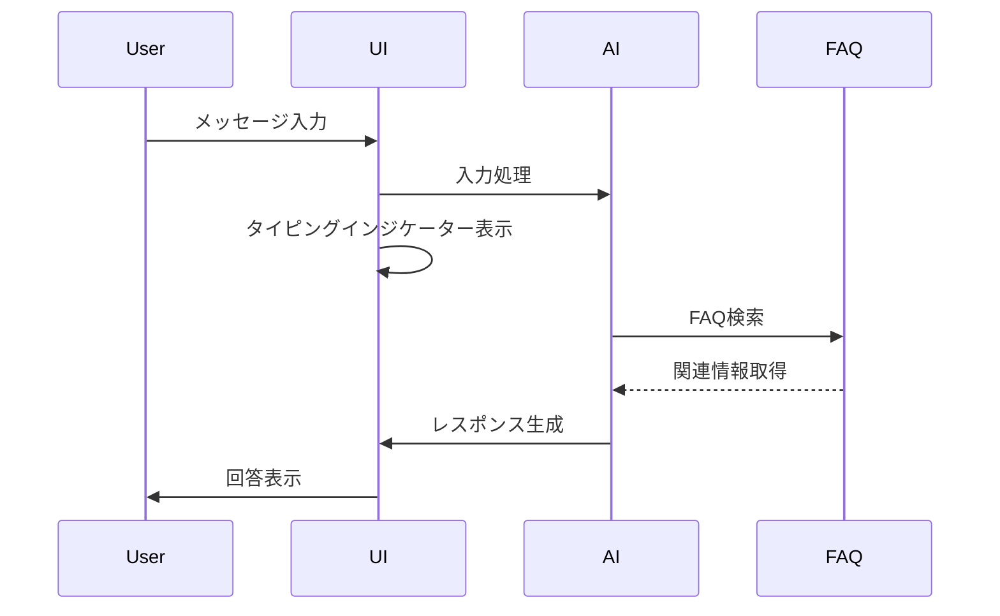
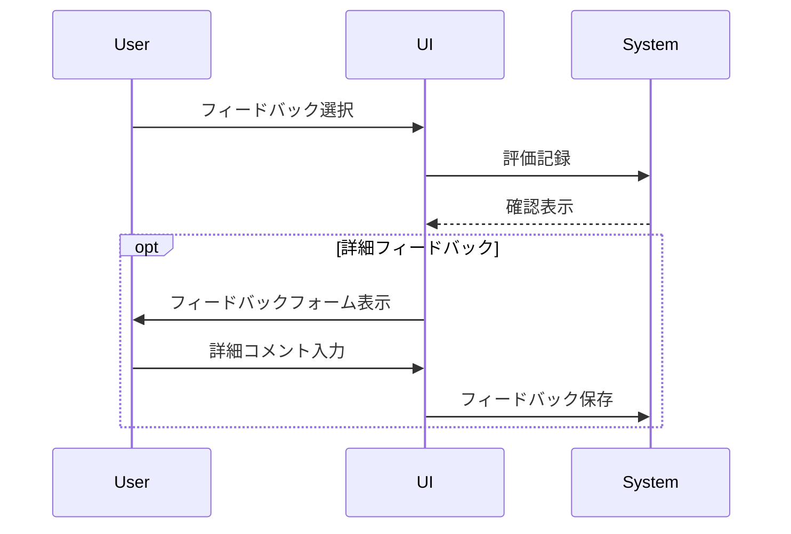

# AIチャットボット画面設計書

## 1. デスクトップレイアウト 🖥️

```plaintext
+------------------------------------------------+
|                  ヘッダー                       |
| [ロゴ]    チャットボットタイトル    [設定] [?] |
+------------------------------------------------+
|                                                |
|                チャットエリア                   |
| +--------------------------------------------+ |
| |                                            | |
| |           ようこそメッセージ               | |
| |     よくある質問やお困りごとについて        | |
| |     お気軽にお尋ねください。               | |
| |                                            | |
| |   [提案される質問トピック]                 | |
| |   ・アカウントについて                     | |
| |   ・サービスの使い方                       | |
| |   ・トラブルシューティング                 | |
| |                                            | |
| |   +------------------------------------+   | |
| |   |           ユーザーメッセージ        |   | |
| |   |                                    |   | |
| |   +------------------------------------+   | |
| |                                            | |
| |   +------------------------------------+   | |
| |   |         AIレスポンス                |   | |
| |   | ・回答テキスト                      |   | |
| |   | ・関連リンク                        |   | |
| |   | ・提案アクション                    |   | |
| |   |                                    |   | |
| |   | [役に立った] [役に立たなかった]     |   | |
| |   +------------------------------------+   | |
| |                                            | |
| |   [タイピングインジケーター...]           | |
| |                                            | |
| +--------------------------------------------+ |
|                                                |
|          メッセージ入力エリア                  |
| +------------------------------------------+   |
| | メッセージを入力                         |   |
| +------------------------------------------+   |
| [添付] [絵文字]                [送信]         |
+------------------------------------------------+
```

## 2. モバイルレイアウト 📱

```plaintext
+----------------------+
|       ヘッダー       |
| [≡] タイトル [設定] |
+----------------------+
|                      |
|    チャットエリア    |
|                      |
| +------------------+ |
| | ようこそメッセージ| |
| +------------------+ |
|                      |
| [質問トピック ▼]    |
|                      |
| +------------------+ |
| | ユーザーメッセージ| |
| +------------------+ |
|                      |
| +------------------+ |
| |   AIレスポンス   | |
| | ・回答           | |
| | ・リンク         | |
| |                  | |
| | [👍] [👎]      | |
| +------------------+ |
|                      |
| [入力中...]         |
|                      |
+----------------------+
|   メッセージ入力    |
| [📎] [入力欄] [➤] |
+----------------------+
```

## 3. インタラクションフロー 🔄

### 3.1 基本チャットフロー



### 3.2 フィードバックフロー



## 4. UI要素仕様 🎨

### 4.1 メッセージバブル

```css
/* ユーザーメッセージ */
.user-message {
  background: #E3F2FD;
  border-radius: 16px 16px 4px 16px;
  padding: 12px 16px;
  margin: 8px 48px 8px 12px;
}

/* AIレスポンス */
.ai-response {
  background: #FFFFFF;
  border: 1px solid #E0E0E0;
  border-radius: 16px 16px 16px 4px;
  padding: 12px 16px;
  margin: 8px 12px 8px 48px;
}
```

### 4.2 インタラクション要素

```yaml
入力フィールド:
  - プレースホルダー: "メッセージを入力してください"
  - 最大文字数: 1000
  - 自動リサイズ: true
  - 送信トリガー: Enter / 送信ボタン

送信ボタン:
  - デフォルト状態: 無効（入力なし）
  - アクティブ状態: 有効（入力あり）
  - ホバー効果: スケール変更

添付機能:
  - 許可形式: 画像, PDF
  - サイズ制限: 5MB
  - プレビュー表示: true
```

## 5. アクセシビリティ対応 ♿

### 5.1 ARIA属性実装

```yaml
チャットコンテナ:
  role: "complementary"
  aria-label: "チャットボット"

メッセージエリア:
  role: "log"
  aria-live: "polite"

入力フォーム:
  role: "form"
  aria-label: "メッセージ入力"

送信ボタン:
  role: "button"
  aria-label: "メッセージを送信"
```

### 5.2 キーボード操作

```yaml
ショートカット:
  - 送信: Ctrl/Cmd + Enter
  - 添付: Ctrl/Cmd + Shift + A
  - 履歴スクロール: ↑/↓
  - フォーカス移動: Tab

フォーカス管理:
  - フォーカス可能な要素の明確な表示
  - 論理的なタブ順序
  - フォーカストラップ（モーダル時）
```

## 6. レスポンシブ対応 📱

### 6.1 ブレークポイント設定

```css
/* モバイル */
@media (max-width: 767px) {
  .chat-container {
    height: 100vh;
    padding: 0;
  }
  
  .message-input {
    position: fixed;
    bottom: 0;
  }
}

/* タブレット */
@media (min-width: 768px) and (max-width: 1023px) {
  .chat-container {
    max-width: 600px;
    margin: auto;
  }
}

/* デスクトップ */
@media (min-width: 1024px) {
  .chat-container {
    max-width: 800px;
    margin: auto;
  }
}
```

## 7. アニメーション設計 ✨

### 7.1 トランジション効果

```css
/* メッセージ表示アニメーション */
.message-enter {
  opacity: 0;
  transform: translateY(20px);
}

.message-enter-active {
  opacity: 1;
  transform: translateY(0);
  transition: all 0.3s ease-out;
}

/* タイピングインジケーター */
.typing-indicator {
  animation: typing 1.5s infinite;
}

@keyframes typing {
  0% { opacity: 0.3; }
  50% { opacity: 1; }
  100% { opacity: 0.3; }
}
```

## 8. エラー処理 ⚠️

### 8.1 エラー表示

```yaml
エラーパターン:
  接続エラー:
    表示: "インターネット接続を確認してください"
    アクション: "再試行"

  入力エラー:
    表示: "メッセージを入力してください"
    アクション: なし

  添付エラー:
    表示: "ファイルサイズが大きすぎます"
    アクション: "別のファイルを選択"

表示スタイル:
  - エラーアイコン
  - エラーメッセージ
  - アクションボタン（該当時）
  - 自動消去（5秒後）
```

## 9. パフォーマンス最適化 🚀

### 9.1 メッセージ読み込み

```yaml
最適化戦略:
  - メッセージの仮想化スクロール
  - 画像の遅延読み込み
  - メッセージのページング処理
  - キャッシュの活用

初期表示の高速化:
  - 重要コンテンツの優先読み込み
  - スケルトンUI表示
  - プリフェッチ対象の最適化
```

## 10. 多言語対応 🌐

### 10.1 言語切替

```yaml
言語設定:
  - 自動言語検出
  - 手動切替オプション
  - 言語別フォントセット

メッセージ表示:
  - RTL言語サポート
  - 文字サイズ自動調整
  - 翻訳インターフェース