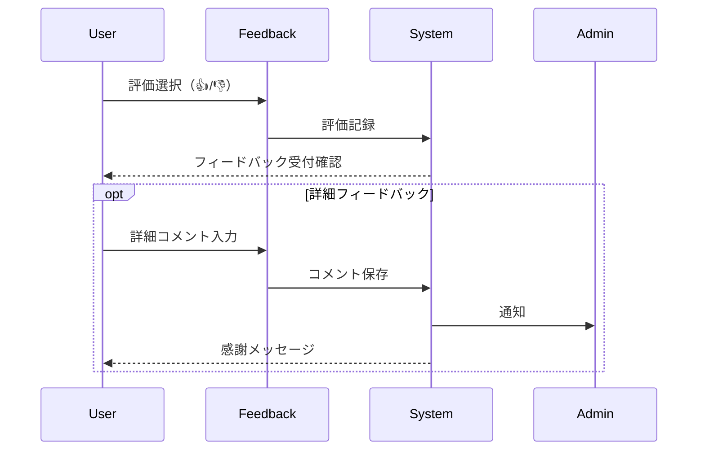
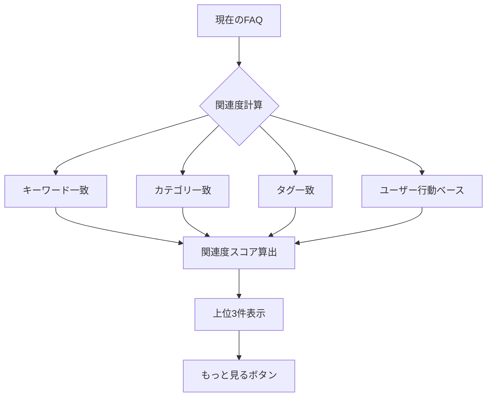
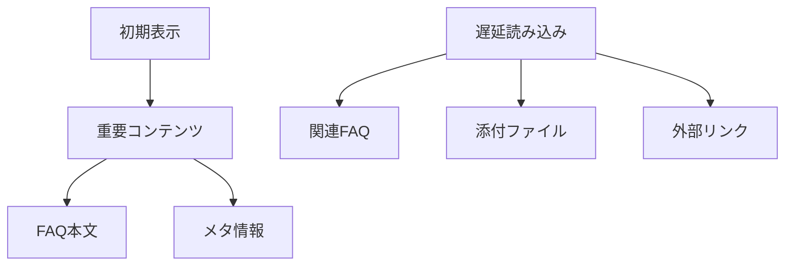

# FAQ詳細画面 改善版ワイヤーフレーム

## 1. デスクトップレイアウト 🖥️

```plaintext
+------------------------------------------------+
|                  ヘッダー                       |
+------------------------------------------------+
|  パンくずリスト > カテゴリ > サブカテゴリ > FAQ  |
+------------------------------------------------+
|                                |                |
|      メインコンテンツ          |   サイドバー    |
| +----------------------------+ | +------------+ |
| |        FAQ タイトル        | | | クイック    | |
| |                           | | | アクション   | |
| | カテゴリ / タグ            | | |・共有      | |
| |                           | | |・印刷      | |
| | 最終更新: 2025/03/24      | | |・報告      | |
| +----------------------------+ | +------------+ |
| |                           | |              |
| |      本文セクション        | | 目次         |
| |                           | | ・セクション1 | |
| | • 見出し1                 | | ・セクション2 | |
| |   - 内容                  | | ・セクション3 | |
| |   - 補足説明              | |              |
| |                           | |              |
| | • 見出し2                 | |              |
| |   - 内容                  | |              |
| |   - 画像/図表             | |              |
| |                           | |              |
| +----------------------------+ |              |
|                               |              |
| +----------------------------+ |              |
| |     添付ファイル           | |              |
| | [ファイル1] [ファイル2]    | |              |
| +----------------------------+ |              |
|                               |              |
| +----------------------------+ +------------+ |
| |    フィードバックセクション |              |
| | このFAQは役に立ちましたか？ |              |
| | [はい] [いいえ]            |              |
| |                           |              |
| | [詳細フィードバックを書く]  |              |
| +----------------------------+              |
|                                            |
| +----------------------------+              |
| |      関連情報              |              |
| |                           |              |
| | 参考リンク                 |              |
| | ・公式ドキュメント         |              |
| | ・関連ガイドライン         |              |
| | ・チュートリアル           |              |
| +----------------------------+              |
|                                            |
| +----------------------------+              |
| |      関連FAQ              |              |
| | +------------------------+ |              |
| | | FAQ1                  | |              |
| | | - プレビュー          | |              |
| | | - 関連度: 95%        | |              |
| | +------------------------+ |              |
| |                           |              |
| | +------------------------+ |              |
| | | FAQ2                  | |              |
| | | - プレビュー          | |              |
| | | - 関連度: 87%        | |              |
| | +------------------------+ |              |
| |                           |              |
| | [関連FAQをもっと見る]      |              |
| +----------------------------+              |
|                                            |
+--------------------------------------------+

```

## 2. モバイルレイアウト 📱

```plaintext
+------------------------+
|        ヘッダー        |
+------------------------+
|     パンくずリスト     |
+------------------------+
|      FAQ タイトル      |
|                        |
| カテゴリ / タグ        |
| 最終更新: 2025/03/24   |
+------------------------+
| [目次を表示/非表示 ▼]  |
| ・セクション1          |
| ・セクション2          |
| ・セクション3          |
+------------------------+
|    本文セクション      |
|                        |
| • 見出し1             |
|   - 内容              |
|   - 補足説明          |
|                        |
| • 見出し2             |
|   - 内容              |
|   - 画像/図表         |
+------------------------+
|     添付ファイル       |
| [ファイル1] [ファイル2]|
+------------------------+
|  クイックアクション    |
| [共有] [印刷] [報告]  |
+------------------------+
|      フィードバック    |
| 役に立ちましたか？     |
| [👍] [👎]            |
|                        |
| [詳細フィードバック]   |
+------------------------+
|      関連情報         |
| [タブ切り替え]        |
| ・参考リンク          |
| ・関連FAQ             |
+------------------------+
```

## 3. インタラクション設計 🔄

### 3.1 フィードバックフロー



### 3.2 関連FAQ表示ロジック



## 4. アクセシビリティ対応 ♿

### 4.1 WAI-ARIA実装

```yaml
構造化マークアップ:
  article:
    role: "article"
    aria-labelledby: "faq-title"
  
  セクション:
    - role: "region"
      aria-label: "FAQ本文"
    - role: "complementary"
      aria-label: "関連情報"
    
  フィードバック:
    role: "form"
    aria-label: "FAQフィードバック"
    
  関連FAQ:
    role: "navigation"
    aria-label: "関連FAQ"
```

## 5. レスポンシブ対応 📱

### 5.1 ブレークポイント別レイアウト

```css
/* デスクトップ（1024px以上）*/
.faq-detail {
  display: grid;
  grid-template-columns: 2fr 1fr;
  gap: 2rem;
}

/* タブレット（768px〜1023px）*/
.faq-detail {
  display: grid;
  grid-template-columns: 1fr;
  gap: 1.5rem;
}

/* モバイル（767px以下）*/
.faq-detail {
  display: flex;
  flex-direction: column;
  gap: 1rem;
}
```

## 6. パフォーマンス最適化 🚀

### 6.1 コンテンツ読み込み



### 6.2 画像最適化

```yaml
画像処理:
  - レスポンシブ画像
  - 遅延読み込み
  - WebP形式対応
  - サムネイル生成
```

## 7. SEO対策 🔍

### 7.1 構造化データ

```json
{
  "@context": "https://schema.org",
  "@type": "FAQPage",
  "mainEntity": {
    "@type": "Question",
    "name": "FAQ質問",
    "acceptedAnswer": {
      "@type": "Answer",
      "text": "FAQ回答"
    },
    "datePublished": "2025-03-24",
    "dateModified": "2025-03-24"
  }
}
```

## 8. ユーザー行動追跡 📊

### 8.1 トラッキングポイント

```yaml
計測項目:
  - スクロール深度
  - 滞在時間
  - クリックイベント
  - フィードバック
  - 関連FAQクリック
  - 外部リンククリック