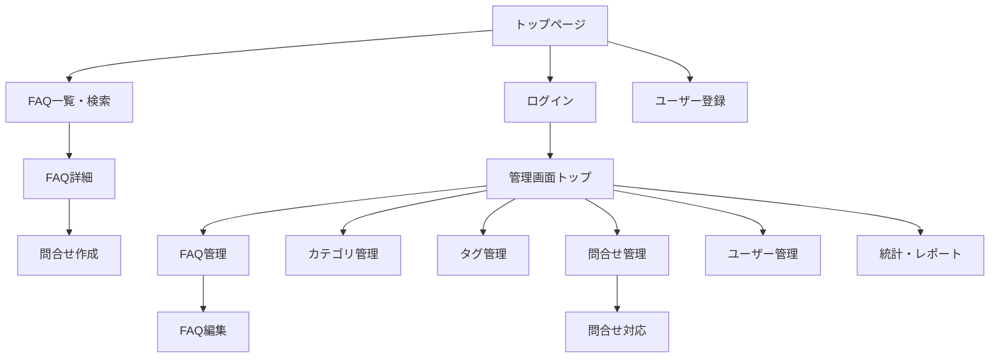
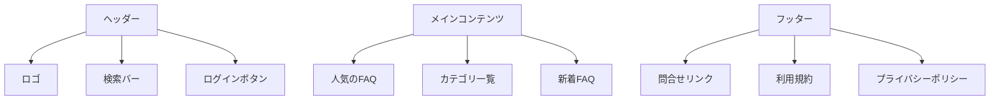
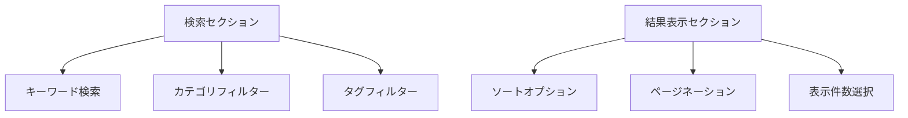
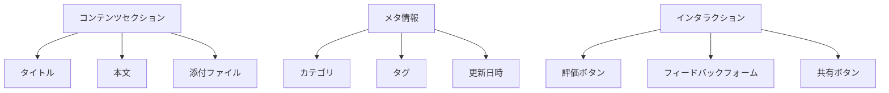
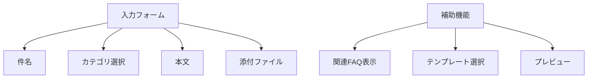
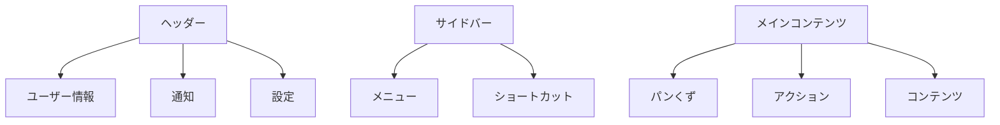

# FAQシステム 画面設計書

## 1. 画面一覧 📱

### 利用者向け画面
1. トップページ
2. FAQ一覧・検索画面
3. FAQ詳細画面
4. 問合せ作成画面
5. 問合せ履歴画面
6. ユーザー登録画面
7. ログイン画面

### 管理者向け画面
1. 管理画面トップ
2. FAQ管理画面
3. カテゴリ管理画面
4. タグ管理画面
5. 問合せ管理画面
6. ユーザー管理画面
7. 統計・レポート画面

## 2. 画面遷移図 🔄



## 3. 画面詳細設計 🎨

### トップページ


#### コンポーネント説明
- **ヘッダー**
  - 常時表示の検索バー
  - ログイン/ユーザーメニュー
  - 多言語切替
- **メインコンテンツ**
  - カテゴリ別FAQ表示
  - タグクラウド
  - 閲覧ランキング
- **フッター**
  - サイトマップ
  - 各種ポリシー
  - お問い合わせ

### FAQ一覧・検索画面


#### 機能要件
- **検索機能**
  - インクリメンタルサーチ
  - カテゴリ/タグによるフィルタリング
  - 検索履歴表示
- **表示オプション**
  - リスト表示/カード表示の切替
  - ソート（関連度/更新日時/評価）
  - 1ページの表示件数変更

### FAQ詳細画面


#### インタラクション要件
- **フィードバック機能**
  - 5段階評価
  - コメント入力
  - 「役に立った/立たなかった」ボタン
- **共有機能**
  - SNSシェア
  - メール共有
  - リンクコピー

### 問合せ作成画面


#### バリデーション要件
- **入力チェック**
  - 必須項目の入力確認
  - 文字数制限
  - ファイルサイズ/形式チェック
- **自動補完**
  - 関連FAQのサジェスト
  - カテゴリの階層表示

### 管理画面共通レイアウト


## 4. レスポンシブデザイン対応 📱

### ブレークポイント
```css
/* モバイル */
@media (max-width: 767px) {
  /* スタイル定義 */
}

/* タブレット */
@media (min-width: 768px) and (max-width: 1023px) {
  /* スタイル定義 */
}

/* デスクトップ */
@media (min-width: 1024px) {
  /* スタイル定義 */
}
```

### モバイル対応要件
- ハンバーガーメニュー
- スワイプナビゲーション
- タップターゲットの最適化
- 縦長レイアウトの採用

## 5. アクセシビリティ対応 ♿

### WAI-ARIA
- ランドマークロール
- ARIA属性の適切な使用
- フォーカス管理

### キーボード操作
- タブ順序の最適化
- ショートカットキーの実装
- フォーカスインジケータ

### スクリーンリーダー対応
- 適切な見出し構造
- 代替テキスト
- エラー通知

## 6. エラー画面設計 ⚠️

### エラーページ
- 404 Not Found
- 403 Forbidden
- 500 Internal Server Error
- メンテナンス画面

### エラー表示要件
- 明確なエラーメッセージ
- 回復のための操作案内
- 問合せ先の提示

## 7. パフォーマンス最適化 🚀

### 表示速度改善
- 画像の遅延読み込み
- コンポーネントの動的インポート
- キャッシュ戦略

### インタラクション最適化
- スケルトンローディング
- 無限スクロール
- デバウンス/スロットル

## 8. アニメーション設計 ✨

### トランジション
```css
/* 基本トランジション */
.transition {
  transition: all 0.3s ease-in-out;
}

/* ページ遷移 */
.page-enter {
  opacity: 0;
  transform: translateX(20px);
}

/* ローディング */
.loading {
  animation: spin 1s linear infinite;
}
```

### インタラクションフィードバック
- ボタンのリップルエフェクト
- フォーム送信時のアニメーション
- エラー表示のシェイク

## 9. 多言語対応 🌐

### 言語切替
- 言語選択インターフェース
- 自動言語検出
- 言語別フォント設定

### 方向性対応
- RTL言語サポート
- 可変レイアウト
- 文字サイズ調整

## 10. テーマ設計 🎨

### カラーパレット
```css
:root {
  /* プライマリカラー */
  --primary-main: #1976D2;
  --primary-light: #42A5F5;
  --primary-dark: #1565C0;
  
  /* セカンダリカラー */
  --secondary-main: #424242;
  --secondary-light: #616161;
  --secondary-dark: #212121;
  
  /* アクセントカラー */
  --accent-main: #FF4081;
  --accent-light: #FF80AB;
  --accent-dark: #F50057;
}
```

### ダークモード対応
```css
[data-theme="dark"] {
  --background: #121212;
  --surface: #1E1E1E;
  --text-primary: rgba(255, 255, 255, 0.87);
  --text-secondary: rgba(255, 255, 255, 0.60);
}