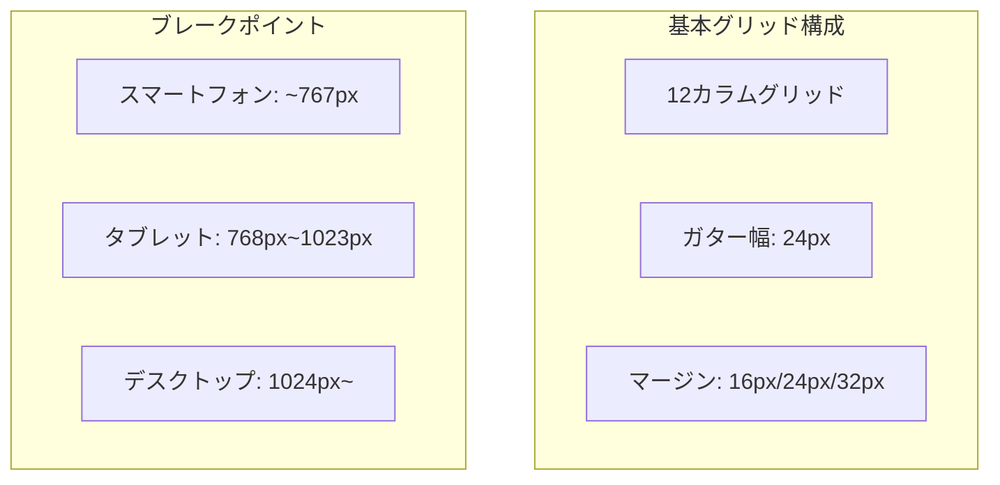
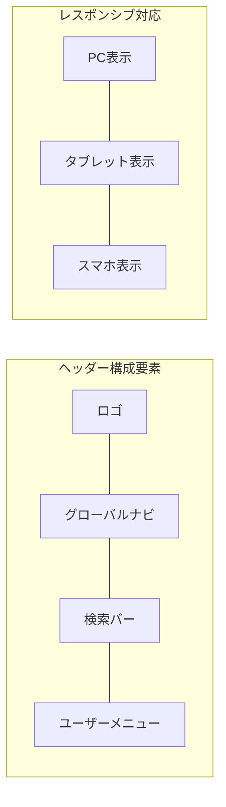
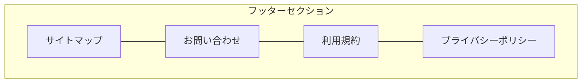
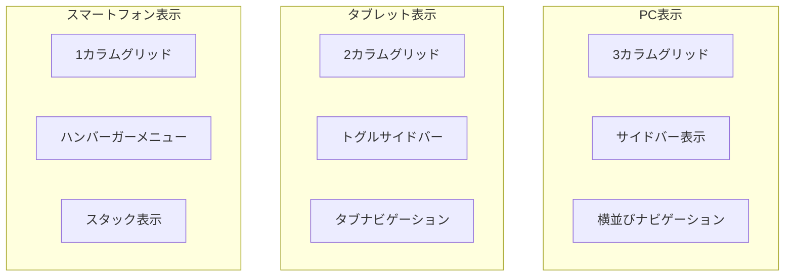
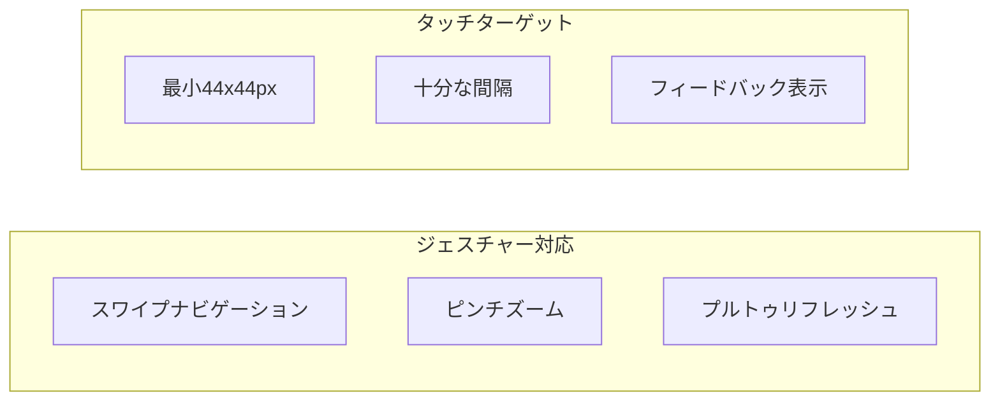
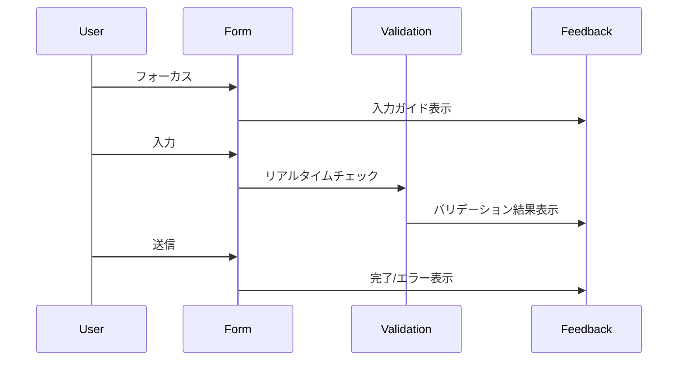
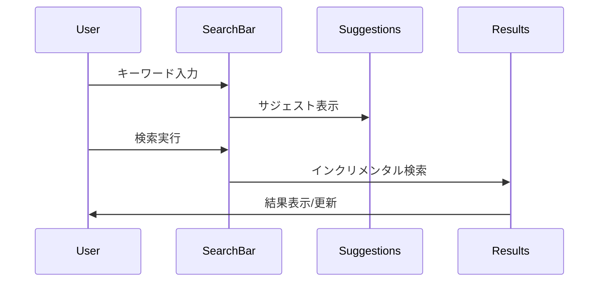
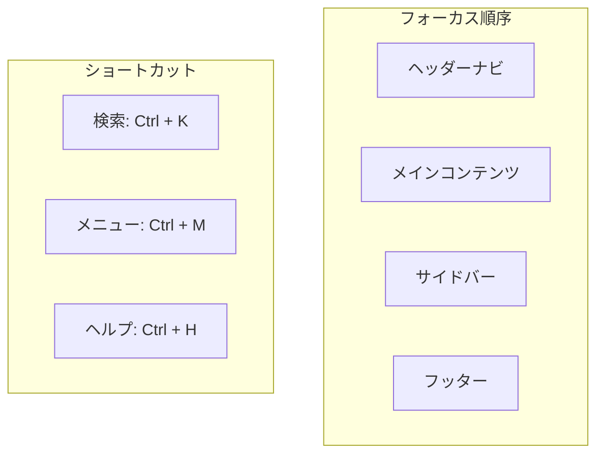
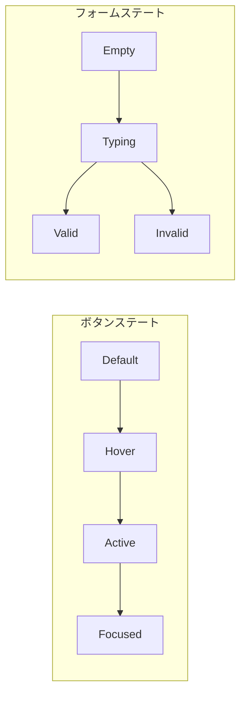
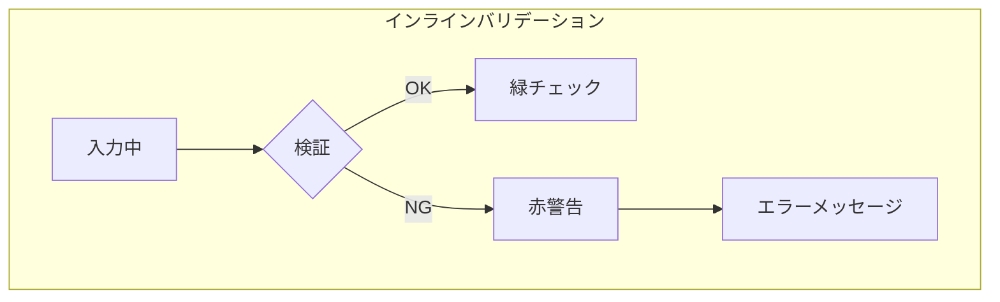

# FAQシステム 画面設計書・ワイヤーフレーム

## 1. 共通レイアウト設計 🔳

### 1.1 レイアウトグリッドシステム



### 1.2 共通ヘッダー構成



### 1.3 フッター構成



## 2. 画面別ワイヤーフレーム 📱

### 2.1 トップページ

```plaintext
+----------------------------------+
|            ヘッダー               |
|  ロゴ  ナビ  検索  ユーザーメニュー  |
+----------------------------------+
|        メインビジュアル           |
|   [サービス説明 / 検索導線]        |
+----------------------------------+
|        カテゴリナビゲーション        |
| [主要カテゴリへのクイックアクセス]   |
+----------------------------------+
|           人気のFAQ              |
| +--------+  +--------+  +------+ |
| |  FAQ1  |  |  FAQ2  |  | FAQ3 | |
| +--------+  +--------+  +------+ |
+----------------------------------+
|           新着FAQ                |
| +--------+  +--------+  +------+ |
| |  FAQ1  |  |  FAQ2  |  | FAQ3 | |
| +--------+  +--------+  +------+ |
+----------------------------------+
|            フッター               |
+----------------------------------+
```

### 2.2 FAQ検索・一覧画面

```plaintext
+----------------------------------+
|            ヘッダー               |
+----------------------------------+
|          検索セクション           |
| +------------------------------+ |
| |        検索バー              | |
| +------------------------------+ |
| フィルター: カテゴリ タグ 日付    |
+----------------------------------+
|        検索結果セクション         |
| 表示件数  ソート  表示切替        |
| +------------------------------+ |
| |        FAQ項目1             | |
| |  タイトル                    | |
| |  プレビュー                  | |
| |  メタ情報                    | |
| +------------------------------+ |
| |        FAQ項目2             | |
| +------------------------------+ |
| |        FAQ項目3             | |
| +------------------------------+ |
+----------------------------------+
|         ページネーション          |
+----------------------------------+
|            フッター              |
+----------------------------------+
```

### 2.3 FAQ詳細画面

```plaintext
+----------------------------------+
|            ヘッダー               |
+----------------------------------+
|        パンくずリスト            |
+----------------------------------+
|         FAQ詳細コンテンツ         |
| タイトル                         |
| カテゴリ / タグ                  |
| +------------------------------+ |
| |        本文セクション         | |
| |                              | |
| |  • 見出し1                   | |
| |    - 内容                    | |
| |  • 見出し2                   | |
| |    - 内容                    | |
| +------------------------------+ |
| 添付ファイル / 画像              |
+----------------------------------+
|         フィードバックセクション   |
| 役に立ちましたか？               |
| [はい] [いいえ]                 |
+----------------------------------+
|         関連FAQセクション        |
| +--------+  +--------+  +------+ |
| |  FAQ1  |  |  FAQ2  |  | FAQ3 | |
| +--------+  +--------+  +------+ |
+----------------------------------+
|            フッター              |
+----------------------------------+
```

### 2.4 問合せフォーム画面

```plaintext
+----------------------------------+
|            ヘッダー               |
+----------------------------------+
|        パンくずリスト            |
+----------------------------------+
|         フォームセクション        |
| [必須] お名前                    |
| +------------------------------+ |
| |                              | |
| +------------------------------+ |
| [必須] メールアドレス            |
| +------------------------------+ |
| |                              | |
| +------------------------------+ |
| [必須] 件名                     |
| +------------------------------+ |
| |                              | |
| +------------------------------+ |
| [必須] お問い合わせ内容          |
| +------------------------------+ |
| |                              | |
| |                              | |
| +------------------------------+ |
| 添付ファイル                     |
| [ファイルを選択]                 |
+----------------------------------+
|        関連FAQ表示セクション      |
| 類似の質問が見つかりました        |
| +------------------------------+ |
| |        関連FAQ1             | |
| +------------------------------+ |
+----------------------------------+
|         確認・送信ボタン          |
| [確認する] [クリア]              |
+----------------------------------+
|            フッター              |
+----------------------------------+
```

### 2.5 管理画面ダッシュボード

```plaintext
+----------------------------------+
|            ヘッダー               |
|  ロゴ        通知  ユーザー情報   |
+----------------------------------+
|      |                          |
| サイド|    コンテンツエリア       |
| メニュー|                        |
|      |    統計情報              |
|      | +--------+  +--------+   |
|      | |アクセス|  |問合せ数|   |
|      | +--------+  +--------+   |
|      |                          |
|      |    最近の問合せ          |
|      | +--------------------+   |
|      | |      表形式        |   |
|      | +--------------------+   |
|      |                          |
|      |    未回答FAQ             |
|      | +--------------------+   |
|      | |      リスト形式     |   |
|      | +--------------------+   |
|      |                          |
+----------------------------------+
```

## 3. レスポンシブ対応設計 📱

### 3.1 デバイス別レイアウト変更



### 3.2 タッチインタラクション設計



## 4. インタラクションパターン 🔄

### 4.1 入力フォーム



### 4.2 検索インタラクション



## 5. アクセシビリティ対応 ♿

### 5.1 キーボードナビゲーション



### 5.2 スクリーンリーダー対応

```yaml
構造化マークアップ:
  見出し: 適切な階層構造
  リスト: 関連項目のグループ化
  テーブル: 行列ヘッダーの明示

ARIA属性:
  ランドマーク: 主要セクションの識別
  ライブリージョン: 動的更新の通知
  ダイアログ: モーダル/ポップアップの制御
```

## 6. アニメーション・トランジション ✨

### 6.1 トランジションタイミング

```css
/* 基本トランジション */
.transition-base {
    transition-duration: 200ms;
    transition-timing-function: ease-out;
}

/* ページ遷移 */
.page-transition {
    transition-duration: 300ms;
    transition-timing-function: ease-in-out;
}

/* フィードバック */
.feedback-animation {
    animation-duration: 150ms;
    animation-timing-function: ease;
}
```

### 6.2 インタラクションステート



## 7. エラーハンドリング ⚠️

### 7.1 エラー表示パターン

```plaintext
+----------------------------------+
|          エラーメッセージ         |
| +------------------------------+ |
| |      アイコン + メッセージ    | |
| |      対処方法の提示          | |
| +------------------------------+ |
|          リカバリーアクション     |
| [再試行] [別の方法] [ヘルプ]     |
+----------------------------------+
```

### 7.2 バリデーションフィードバック



## 8. パフォーマンス最適化 🚀

### 8.1 ローディング表示

```plaintext
+----------------------------------+
|          スケルトンUI            |
| +------------------------------+ |
| |        ████████           | |
| |        ████              | |
| +------------------------------+ |
| +------------------------------+ |
| |        ████████           | |
| |        ████              | |
| +------------------------------+ |
```

### 8.2 遅延読み込み

```mermaid
graph TB
    subgraph "コンテンツ優先順位"
        A[初期表示コンテンツ]
        B[スクロール時読み込み]
        C[ユーザーアクション後読み込み]
    end

    A --> B
    B --> C