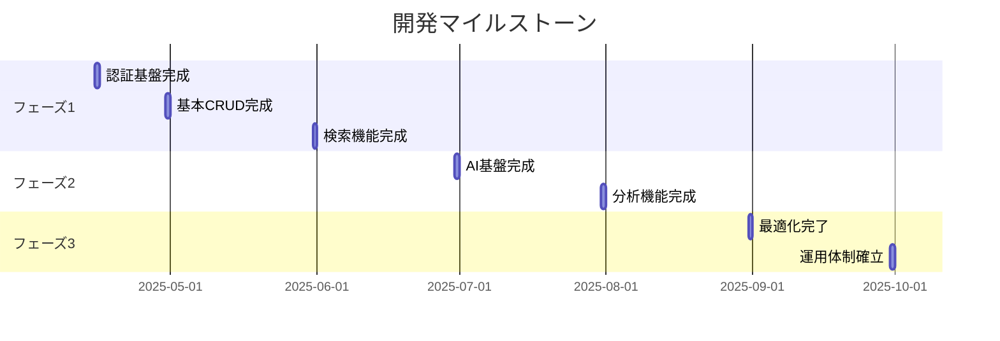

# 開発フェーズ移行判断書

## 1. 📋 移行判断

### 判断結果
✅ **開発フェーズへの移行を承認**

### 判断理由
1. **仕様の完成度**
   - 機能要件が明確に定義され、スコープが確定
   - 非機能要件（性能・セキュリティ）が詳細に規定
   - 技術スタックの選定が完了

2. **計画の具体性**
   - 6ヶ月の開発期間で適切な工程分割
   - フェーズ別のマイルストーンが明確
   - 具体的な成果物が定義済み

3. **リスク評価の充実**
   - 技術的リスクの特定と対策の定義
   - セキュリティ対策の詳細な規定
   - 運用リスクへの対応策の明確化

## 2. 📅 実装計画

### フェーズ別実装スケジュール

#### フェーズ1A：基本機能開発（4/1-4/30）
- Week 1: ユーザー認証基盤構築
- Week 2: FAQ CRUD機能、権限管理
- Week 3: アタッチメント機能、バージョン管理
- Week 4: UI改善、テスト

#### フェーズ1B：検索機能強化（5/1-5/31）
- Week 1: Elasticsearch導入
- Week 2: 高度な検索機能実装
- Week 3: 検索最適化、キャッシュ導入
- Week 4: UI/UX改善、検索統計

#### フェーズ2A：AI機能基盤（6/1-6/30）
- Week 1: AI基盤構築、NLP実装
- Week 2: FAQ連携、文脈理解
- Week 3: 対話フロー最適化
- Week 4: 評価・フィードバック

#### フェーズ2B：分析機能（7/1-7/31）
- Week 1: 分析基盤構築
- Week 2: ダッシュボード開発
- Week 3: レポート自動生成
- Week 4: パフォーマンス最適化

#### フェーズ3A：最適化（8/1-8/31）
- Week 1: パフォーマンス分析
- Week 2: キャッシュ・クエリ最適化
- Week 3: セキュリティ強化
- Week 4: 総合テスト

#### フェーズ3B：運用自動化（9/1-9/30）
- Week 1: CI/CD整備
- Week 2: 監視・バックアップ自動化
- Week 3: 運用ツール開発
- Week 4: 総合テスト・訓練

### マイルストーン

## 3. ⚠️ リスク対策

### 特定されたリスク

#### 技術リスク
1. **パフォーマンス**
   - 対策：段階的な負荷テスト実施
   - 監視：応答時間、リソース使用率
   - 基準：応答時間2秒以内

2. **データ整合性**
   - 対策：トランザクション管理の実装
   - 監視：エラーログ、不整合検知
   - 基準：データ不整合0件

3. **AI精度**
   - 対策：段階的な学習データ拡充
   - 監視：応答精度、誤認識率
   - 基準：回答適合率85%以上

#### スケジュールリスク
1. **開発遅延**
   - 対策：週次進捗確認
   - バッファ：各フェーズ最終週
   - 基準：遅延1週間以内

2. **リソース不足**
   - 対策：事前のリソース確保
   - 監視：工数実績
   - 基準：稼働率80%以下

### モニタリング計画
- 日次：基本メトリクス確認
- 週次：進捗会議、KPI確認
- 月次：品質レビュー、リスク評価

### エスカレーションフロー
1. **レベル1（開発チーム内）**
   - 対応：技術リード
   - 期限：24時間以内

2. **レベル2（プロジェクト管理）**
   - 対応：プロジェクトマネージャー
   - 期限：48時間以内

3. **レベル3（経営層）**
   - 対応：技術責任者
   - 期限：72時間以内

## 4. 🎯 成功基準

### フェーズ別評価指標

#### フェーズ1
- 基本機能完成度：100%
- 単体テストカバレッジ：80%以上
- E2Eテスト成功率：100%

#### フェーズ2
- AI応答正確性：85%以上
- 検索レスポンス：1秒以内
- ユーザー満足度：90%以上

#### フェーズ3
- システム稼働率：99.9%以上
- 運用自動化率：80%以上
- セキュリティ基準適合：100%

### 品質基準
1. **コード品質**
   - Lintエラー：0件
   - 複雑度：10未満
   - コメント率：20%以上

2. **パフォーマンス**
   - ページロード：2秒以内
   - API応答：200ms以内
   - 同時接続：1000ユーザー

3. **セキュリティ**
   - 脆弱性：重大0件
   - OWASP Top10対応：100%
   - セキュリティテスト：全項目パス

### 受け入れ基準
1. **機能要件**
   - 要件充足率：100%
   - バグ残存：重大0件
   - UI/UX基準適合：100%

2. **非機能要件**
   - パフォーマンス基準達成
   - セキュリティ基準適合
   - 運用基準達成

## 5. 🛠️ 開発環境・ツール

### 開発環境
1. **クライアント環境**
   - OS: Windows 10/11, macOS Monterey以降
   - メモリ: 16GB以上
   - ストレージ: 256GB以上SSD
   - CPU: Intel Core i5/AMD Ryzen 5以上

2. **サーバー環境**
   - 開発環境: Docker Container
   - テスト環境: クラウド環境
   - 本番環境: クラウド環境（冗長構成）

### 開発ツール
1. **IDE・エディタ**
   - Visual Studio Code
   - 必須拡張機能:
     - ESLint
     - Prettier
     - Docker
     - Git History

2. **バージョン管理**
   - Git
   - GitHub
   - Git Flow

3. **CI/CD**
   - GitHub Actions
   - Docker
   - Kubernetes

### ミドルウェア
1. **データベース**
   - PostgreSQL 14.x
   - Elasticsearch 7.x
   - Redis 6.x

2. **開発フレームワーク**
   - フロントエンド: React 18.x
   - バックエンド: Express.js 4.x
   - 型システム: TypeScript 4.x

### 監視・分析ツール
1. **アプリケーション監視**
   - NewRelic
   - Datadog

2. **ログ管理**
   - ELK Stack
   - CloudWatch

3. **パフォーマンス分析**
   - Lighthouse
   - WebPageTest